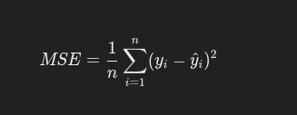
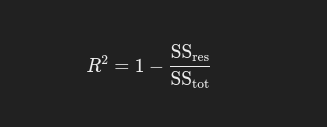
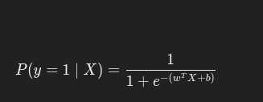
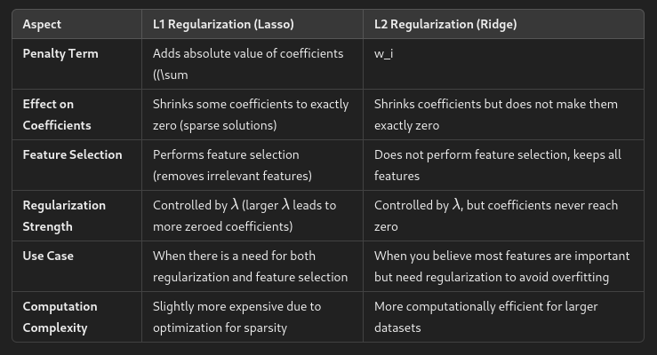
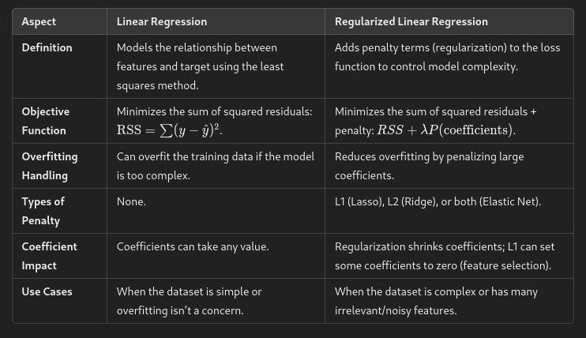

# Supervised Learning 
Supervised learning trains a model using labeled data, where input data (features) is paired with the correct output (labels). The model learns to predict outputs for new data.
#### **How It Works (Logic)**:

1. **Input**: Data with both features and labels.
2. **Training**: Model learns the mapping from inputs to outputs.
3. **Testing**: Evaluate the model on new, unseen data.
---

# Regression & Classification
- **Regression**: Predicts continuous values (e.g., house prices).
- **Classification**: Categorizes data into discrete labels (e.g., spam or not spam).
## Types of Regression 
1.  **Univariate Regression**: Models a relationship between one input feature and the output.
2. **Multivariate Regression**: Models relationships between multiple input features and the output.
3. **Polynomial Regression**: Fits a polynomial curve to the data for non-linear relationships.

```python
from sklearn.linear_model import LinearRegression

X = [[1], [2], [3], [4]]  # Feature
y = [2, 4, 6, 8]          # Label
model = LinearRegression()
model.fit(X, y)
print(model.predict([[5]]))  # Output: 10
```

## Mean Square Error
Measures the average squared difference between predicted and actual values.


```python
from sklearn.metrics import mean_squared_error

mse = mean_squared_error(y_true, y_pred)
```

## R Square Error
Measures how well the model explains the variance in the target variable. Higher values are better.


```python
from sklearn.metrics import r2_score

r2 = r2_score(y_true, y_pred)
```
## Logistic Regression
Used for binary classification. It predicts probabilities and assigns classes based on a threshold (e.g., 0.5).



```python
from sklearn.linear_model import LogisticRegression
from sklearn.model_selection import train_test_split
from sklearn.metrics import accuracy_score

# Sample Data
X = [[1], [2], [3], [4], [5], [6]]  # Features
y = [0, 0, 0, 1, 1, 1]              # Labels (Binary)

# Split Data
X_train, X_test, y_train, y_test = train_test_split(X, y, test_size=0.2, random_state=42)

# Logistic Regression Model
model = LogisticRegression()
model.fit(X_train, y_train)

# Predictions
y_pred = model.predict(X_test)
print("Predictions:", y_pred)
print("Accuracy:", accuracy_score(y_test, y_pred))

```
## Linear Regression
Models the relationship between features and target using the least squares method.

```python
from sklearn.linear_model import LinearRegression

X = [[1], [2], [3], [4]]  # Features
y = [2.2, 4.1, 5.9, 8.0]  # Target

model = LinearRegression()
model.fit(X, y)
print("Coefficients:", model.coef_)
print("Intercept:", model.intercept_)

```

---

# Regularization 
Prevents overfitting by adding a penalty term to the loss function, discouraging overly complex models.
## Bias & Variance
### Bias
Bias measures the error introduced by approximating a real-world problem (which may be complex) using a simplified model. High bias often leads to **underfitting**.
##### **Types of Bias**

1. **Model Bias**:
    
    - Comes from the assumptions a model makes to simplify learning.
    - Example: A linear model has high bias for non-linear data as it assumes linear relationships.
2. **Algorithm Bias**:
    
    - Errors from the algorithm's inability to capture patterns due to its design or inherent assumptions.
    - Example: KNN with a very small kkk value might introduce bias in boundary classification.
3. **Data Bias**:
    
    - Errors from using biased data that misrepresents the true scenario.
    - Example: A dataset containing mostly one gender in a classification task introduces bias towards that gender.
4. **Human Bias**:
    
    - Bias introduced during data collection or annotation due to human decisions.
    - Example: Labeling images with preconceived notions can skew model training.
### Variance
Variance measures the error due to sensitivity to small fluctuations in the training set. High variance leads to **overfitting**, where the model captures noise rather than the actual pattern.

##### **Types of Variance**

1. **Model Variance**:
    
    - Arises when the model is overly complex and too sensitive to small changes in data.
    - Example: A decision tree with many levels can lead to high variance.
2. **Data Variance**:
    
    - Variations in the data itself that cause inconsistent model performance.
    - Example: Random noise in the dataset affects the model's decisions.
3. **Sampling Variance**:
    
    - Caused by differences in data used for training and testing.
    - Example: Small, unrepresentative datasets can lead to models that fail on new data.
4. **Parameter Variance**:
    
    - Errors from inconsistent parameter tuning during model training.
    - Example: Changing hyperparameters like learning rate can result in varying performances.
### **Bias vs. Variance Tradeoff**

- **High Bias**: Simplified models that fail to capture the underlying patterns (underfitting).
- **High Variance**: Complex models that overfit to training data, capturing noise (overfitting).
- **Goal**: Find a balance where the model generalizes well to unseen data.


## Overfitting & Underfitting

**Overfitting**: Model fits training data too well, fails on unseen data.
**Underfitting**: Model fails to capture the underlying trend.

---

## **L1 Regularization (Lasso)**

L1 regularization adds the absolute value of the coefficients as a penalty term to the cost function. This is known as **Lasso (Least Absolute Shrinkage and Selection Operator)**.
##### **Mathematical Formula**:


Where:
- λ\lambdaλ is the regularization parameter (controls the strength of the penalty).
- wiw_iwi​ are the model coefficients.
##### **Key Characteristics**:

- **Sparsity**: L1 regularization can shrink some coefficients to exactly zero, which means that some features are effectively eliminated from the model.
- **Feature Selection**: It inherently performs feature selection by reducing irrelevant feature coefficients to zero.
- **Useful when**: You have a large number of features and suspect many are irrelevant.

```python
from sklearn.linear_model import Lasso

X = [[1], [2], [3], [4]]  # Features
y = [2.2, 4.1, 5.9, 8.0]  # Target

model = Lasso(alpha=0.1)  # Regularization strength
model.fit(X, y)
print("Lasso Coefficients:", model.coef_)

```
## **L2 Regularization (Ridge)**

L2 regularization adds the square of the coefficients as a penalty term to the cost function. This is known as **Ridge** regularization.

##### **Mathematical Formula**:


Where:

- λ\lambdaλ is the regularization parameter (controls the strength of the penalty).
- wiw_iwi​ are the model coefficients.

##### **Key Characteristics**:

- **No Sparsity**: L2 regularization will shrink coefficients towards zero, but they will never reach exactly zero.
- **Less Feature Selection**: L2 doesn't perform explicit feature selection; it only reduces the magnitude of the coefficients.
- **Useful when**: You believe all features should be included but need to prevent overfitting

```python
from sklearn.linear_model import Ridge

model = Ridge(alpha=0.1)  # Regularization strength
model.fit(X, y)
print("Ridge Coefficients:", model.coef_)
```
## Difference Between L1 and L2 Regularization


- **L1 Regularization (Lasso)**: Encourages sparsity by setting coefficients to zero, useful for feature selection.
- **L2 Regularization (Ridge)**: Shrinks coefficients without making them zero, useful when all features are believed to be important but need regularization.
## Regularised Linear Regression
Combines linear regression with regularization (L1 or L2) to prevent overfitting.
#### **When to Use Regularized Linear Regression**

- **High Dimensionality**: When there are many features relative to the number of data points.
- **Multicollinearity**: When features are highly correlated.
- **Overfitting**: To prevent overfitting on complex data.


## Decision Trees (ID3, C4.5, CART)
Decision trees are a type of supervised learning algorithm used for both classification and regression tasks. The goal is to model decisions and their possible consequences, making them intuitive and easy to understand.

In decision trees, data is split at each node based on the feature that gives the best split (using some criterion). These trees continue branching until they meet a stopping condition, such as when all data in a node belong to the same class or when a predefined depth is reached.
### **ID3**
an algorithm used to generate decision trees, introduced by Ross Quinlan in 1986. It builds a tree by choosing the best feature to split on at each step using the **information gain** criterion.


### C4.5
**C4.5** is an extension of the ID3 algorithm, developed by Ross Quinlan in 1993. It also builds decision trees, but it improves upon ID3 by addressing some limitations.
#### Gain Ratio Formula


### CART
Classification and Regression Trees is another decision tree algorithm that can be used for both classification (CART classification) and regression (CART regression). It was introduced by Breiman et al. in 1986.


### Differences Between ID3, C4.5, and CART


## Confusion Matrix
Summarizes classification performance.


## K-Folds Cross-Validation
**K-Folds Cross-Validation** is a technique used to evaluate the performance of machine learning models. It is primarily used to assess how well a model generalizes to unseen data by dividing the dataset into multiple parts (or "folds") and training the model multiple times, each time using a different fold for validation.

Libraries used to K-Folds:
```python 
from sklearn.model_selection import cross_val_score 
from sklearn.ensemble import RandomForestClassifier 
from sklearn.datasets import load_iris
```
## KNN
**K-Nearest Neighbors (KNN)** is a simple and powerful algorithm used for both **classification** and **regression** tasks. It makes predictions based on the closest labeled data points in the feature space.
**Mathematical Formula**:


**Implementation**
```python 
from sklearn.neighbors import KNeighborsClassifier

model = KNeighborsClassifier(n_neighbors=3)
model.fit(X_train, y_train)
print(model.predict(X_test))
```
## SVM
**Support Vector Machine (SVM)** is a supervised machine learning algorithm primarily used for **classification** tasks but can also be adapted for **regression** (known as Support Vector Regression or SVR). The goal of SVM is to find the **hyperplane** that best separates the data into different classes with the **maximum margin**.

**Mathematical Formula:**

**Implementation** 
```python
from sklearn.svm import SVC

model = SVC(kernel='linear')
model.fit(X_train, y_train)
print(model.predict(X_test))
```