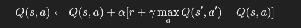

# Probabilistic Learning
Probabilistic learning is a machine learning approach based on probability theory. It models uncertainty in data by estimating probabilities for various outcomes. The goal is to predict future events or outcomes based on observed data.
## Bayesian Learning
Bayesian learning is a probabilistic approach where the Bayes' theorem is used to update the probability of a hypothesis as more evidence or data becomes available.

**Bayes' Theorem**:

Where:

- **P(H∣E)**: Posterior probability (probability of hypothesis H given evidence E).
- **P(E∣H)**: Likelihood (probability of evidence given hypothesis).
- **P(H)**: Prior probability (initial belief about hypothesis).
- **P(E):** Evidence probability.
## Naive Bayes Classifier
The **Naive Bayes Classifier** is a probabilistic algorithm based on Bayes' theorem. It assumes that all features are independent, which simplifies calculations.

**Steps**:
1. Calculate prior probabilities for each class.
2. Compute the likelihood for each feature given the class.
3. Use Bayes' theorem to calculate posterior probabilities for each class.
4. Assign the data point to the class with the highest posterior probability.

```python
from sklearn.naive_bayes import GaussianNB
from sklearn.model_selection import train_test_split
from sklearn.metrics import accuracy_score

# Sample data
X = [[1, 2], [1, 4], [1, 0], [4, 2], [4, 4], [4, 0]]
y = [0, 0, 0, 1, 1, 1]

# Train-Test split
X_train, X_test, y_train, y_test = train_test_split(X, y, test_size=0.3, random_state=42)

# Naive Bayes
clf = GaussianNB()
clf.fit(X_train, y_train)
predictions = clf.predict(X_test)

# Accuracy
print(f'Accuracy: {accuracy_score(y_test, predictions)}')
```
## Bayesian Belief Networks
Bayesian Belief Networks are directed acyclic graphs (DAGs) representing the probabilistic relationships between a set of variables. Each node represents a variable, and edges denote dependencies.

**Applications**: Diagnosis, prediction, and decision-making under uncertainty.

---
# Ensembles Learning
Ensemble learning combines multiple models (weak learners) to improve the overall performance. Common techniques include:

1. **Bagging (Bootstrap Aggregating)**: Combines models by averaging predictions (e.g., Random Forest).
2. **Boosting**: Focuses on learning from the mistakes of previous models (e.g., Gradient Boosting, XGBoost).


## Random Forest
Random Forest is an ensemble learning method that combines multiple decision trees to make a prediction.

- Uses bagging and random feature selection for robustness.
- Effective in handling overfitting.

```python
from sklearn.ensemble import RandomForestClassifier

X = [[1, 2], [1, 4], [1, 0], [4, 2], [4, 4], [4, 0]]
y = [0, 0, 0, 1, 1, 1]

clf = RandomForestClassifier(n_estimators=10, random_state=42)
clf.fit(X, y)
predictions = clf.predict([[2, 2]])
print(f'Prediction: {predictions}')
```

Check out [Random Forest](https://mlu-explain.github.io/random-forest/) 
## Gradient Boosting
Gradient Boosting is a boosting algorithm that builds models sequentially, where each model corrects errors made by the previous one.
## XGBoost
XGBoost (Extreme Gradient Boosting) is an efficient and scalable version of Gradient Boosting.  
**Features**: Regularization, parallel processing, and handling missing values.

```python
from xgboost import XGBClassifier

X = [[1, 2], [1, 4], [1, 0], [4, 2], [4, 4], [4, 0]]
y = [0, 0, 0, 1, 1, 1]

clf = XGBClassifier(use_label_encoder=False, eval_metric='logloss')
clf.fit(X, y)
predictions = clf.predict([[2, 2]])
print(f'Prediction: {predictions}')
```

---
# Reinforcement Learning 
Reinforcement Learning (RL) involves learning by interacting with an environment to maximize cumulative rewards. An agent takes actions based on its current state, and the environment provides feedback in the form of rewards or penalties.
## Models of Reinforcement Learning
1. **Value-Based**: Focuses on finding the optimal value function (e.g., Q-Learning).
2. **Policy-Based**: Directly optimizes the policy (e.g., REINFORCE).
3. **Model-Based**: Builds a model of the environment for planning.
### Markov Decision Process
MDP provides a mathematical framework for decision-making in RL.  
**Components**:

- **States (S)**: Possible situations.
- **Actions (A)**: Choices available.
- **Rewards (R)**: Feedback from the environment.
- **Transitions (P)**: Probabilities of moving between states.
### Q-Learning
Q-Learning is a value-based RL algorithm to learn the optimal policy by updating Q-values:


.png)

```python
import numpy as np

# Parameters
alpha, gamma, episodes = 0.1, 0.9, 100
states, actions = 5, 2
Q = np.zeros((states, actions))

# Simulated environment
for episode in range(episodes):
    state = np.random.randint(0, states)
    for _ in range(10):
        action = np.random.choice(actions)
        next_state = (state + action) % states
        reward = np.random.rand()
        Q[state, action] += alpha * (reward + gamma * np.max(Q[next_state]) - Q[state, action])
        state = next_state

print("Q-Table:\n", Q)
```