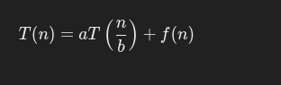

# Foundation of Algorithms Analysis and Design

## Algorithms
An algorithm is a step-by-step, finite sequence of instructions to solve a problem. It must be clear, precise, and terminate in a finite number of steps. Algorithms are widely used in computer science to structure problem-solving.

### Properties of Algorithms
- Clear, finite, and unambiguous steps.

### Design Techniques
- Divide-and-conquer
- Greedy
- Dynamic programming

## Analyzing Algorithms
Analyzing an algorithm determines its efficiency regarding time (execution duration) and space (memory consumption).

## Complexity of Algorithms
### Time Complexity
How the running time of an algorithm increases with input size.

### Space Complexity
Amount of memory required.

---

## Amortized Analysis
Amortized analysis calculates the average time per operation over a sequence of operations, even if some operations are expensive. Example: Dynamic array resizing.

## Growth of Functions
Describes how a function's value increases with input size. Common growth functions: O(1), O(log n), etc.

## Methods of Solving Recurrences
### Substitution
The **substitution method** is a technique used to solve recurrence relations by guessing the solution and proving it correct using **mathematical induction**. It's particularly useful when solving recurrence relations in algorithms, such as analyzing recursive programs.

1. **Use induction to prove:**
   - **Base case:** Verify that the guessed solution satisfies the recurrence for the smallest input.
   - **Inductive step:** Assume the solution works for n=k, and prove it holds for n=k+1.

```cpp
#include <iostream>
using namespace std;

// Recursive function for T(n)
int solveRecurrence(int n) {
    if (n == 1) return 1; // Base case
    return 2 * solveRecurrence(n / 2) + n;
}

// Test
int main() {
    int n = 8; // Example input size
    cout << "T(" << n << ") = " << solveRecurrence(n) << endl;
    return 0;
}
```

### Recurrence Tree
The **recurrence tree method** is a visual approach used to solve recurrence relations by representing the recursive calls of an algorithm as a tree. Each node of the tree represents a subproblem, and the cost of solving it is represented at that level. The total cost is obtained by summing the costs at all levels of the tree.

#### How It Works (Logic)
1. **Break Down the Recurrence:**  Start by expanding the recurrence relation into smaller subproblems recursively until reaching the base case.
2. **Visualize as a Tree:**  Each recursive call forms a node. The child nodes represent the recursive calls made by the parent node.
3. **Calculate Costs per Level:**  At each level, compute the cost of solving all subproblems at that level.
4. **Sum Across All Levels:**  Add up the costs at all levels to determine the total cost of the recurrence.

```cpp
#include <iostream>
using namespace std;

// Function to simulate cost at each level
void recurrenceTree(int n, int level = 0) {
    if (n <= 1) {
        cout << "Level " << level << ": Cost = " << n << endl;
        return;
    }
    cout << "Level " << level << ": Cost = " << n << endl;
    recurrenceTree(n / 2, level + 1);
    recurrenceTree(n / 2, level + 1);
}

// Test
int main() {
    int n = 8; // Example input size
    cout << "Recurrence Tree for T(n) = 2T(n/2) + n:\n";
    recurrenceTree(n);
    return 0;
}
```

### Master Theorem
**Master's theorem** is a tool used to solve recurrence relations of the form:



Here:
- a: The number of subproblems at each level.
- b: The factor by which the problem size is divided.
- f(n): The cost of work outside the recursive calls (e.g., merging or dividing).

```cpp
#include <iostream>
#include <cmath>
using namespace std;

// Function to compute T(n) for T(n) = aT(n/b) + f(n)
int solveMaster(int n, int a, int b, int (*f)(int)) {
    if (n <= 1) return f(1); // Base case
    return a * solveMaster(n / b, a, b, f) + f(n);
}

// Example function f(n) = n
int f(int n) {
    return n;
}

// Test
int main() {
    int n = 8, a = 2, b = 2;
    cout << "T(" << n << ") = " << solveMaster(n, a, b, f) << endl;
    return 0;
}
```

---

## Performance Measurements
Metrics to evaluate algorithms, including execution time and memory consumption.

## Time and Space Complexity of an Algorithm
**Time complexity:** Measures the number of basic operations.  
**Space complexity:** Tracks the additional memory used.

## Asymptotic Notations
Used to describe complexity:
- **Big-O (O):** Upper bound.
- **Theta (Θ):** Tight bound.
- **Omega (Ω):** Lower bound.

---

## Abstract Data Types (ADT)
An ADT specifies the behavior of data structures without implementation details. Example: Stack, Queue, List.

# Fundamentals of Data Structures
Data structures organize and manage data efficiently.

## Data Types
1. **Primitive:** Integer, float, character, etc.
2. **Non-Primitive:** Arrays, lists, stacks, etc.

### Primitive and Non-Primitive
- **Primitive:** Basic types like `int`, `float`.
- **Non-Primitive:** User-defined or composite types like arrays.

### Introduction to Data Structure 
A data structure is a way to organize, manage, and store data for efficient access and modification.

### Types of Data Structures
#### Linear & Non-Linear Data Structures
- **Linear:** Elements in a sequence. (Stack, Queue)
- **Non-Linear:** Elements in a hierarchy or graph.