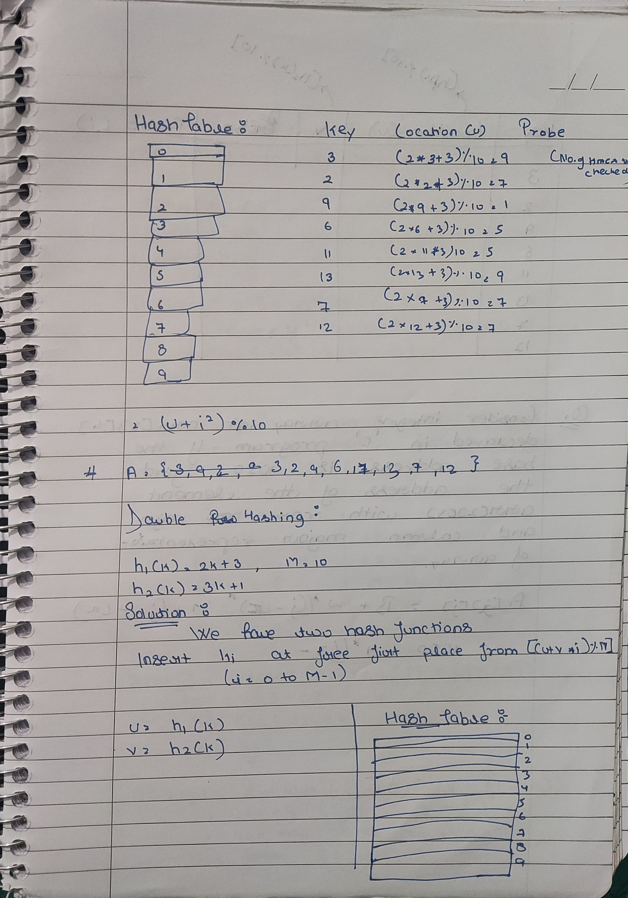
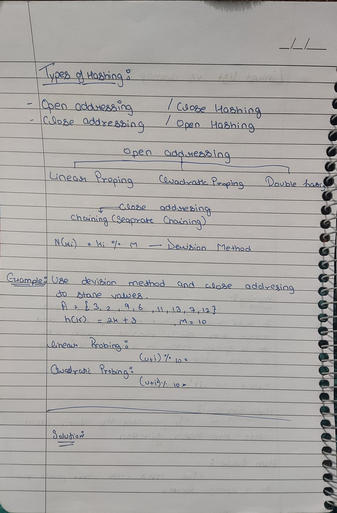
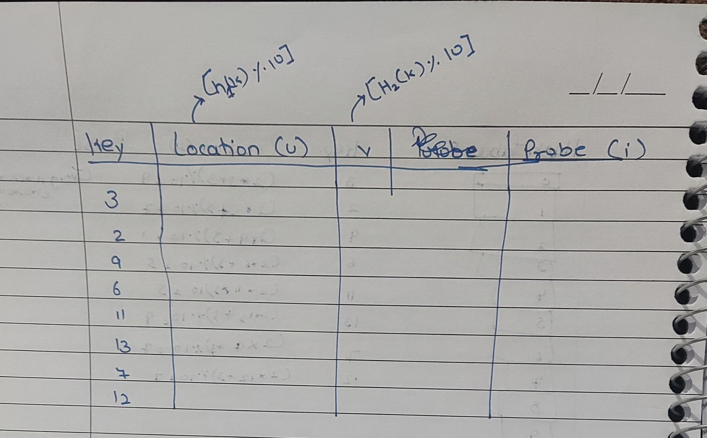
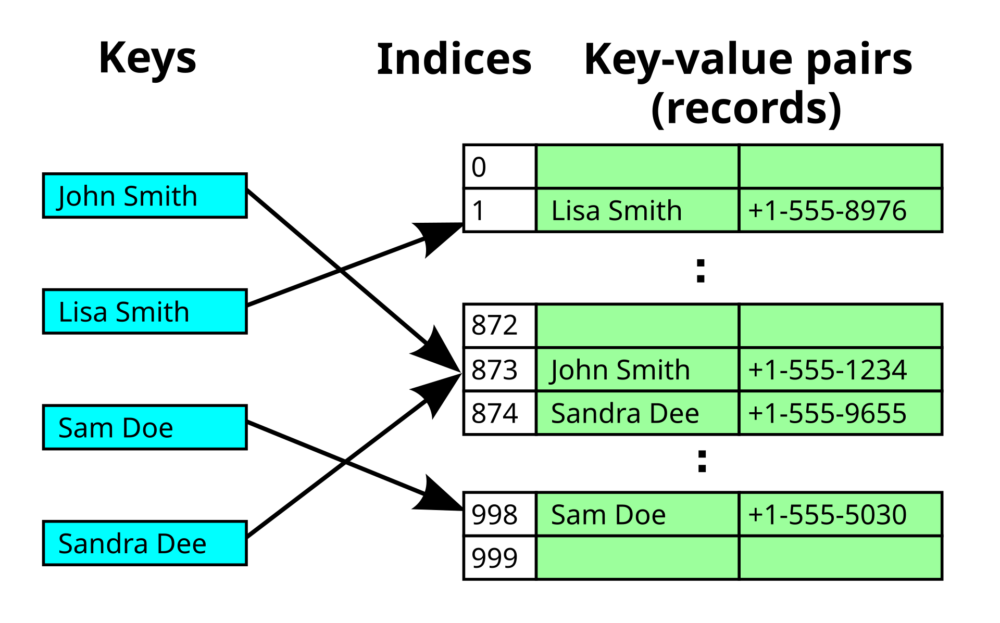
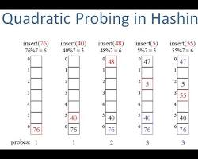
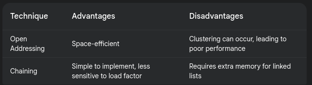

# Arrays 
## Definition 
An **array** is a collection of elements stored in contiguous memory locations, where each element is accessed using an **index**. Arrays store multiple values of the same data type.
## Single and Multidimensional Arrays
1. **Single-Dimensional Array (1-D):**  
    A linear list of elements. Example:
    
    arr=[10,20,30,40]
2. **Multi-Dimensional Array:**  
    Arrays with more than one dimension, used to represent matrices or tensors.
    
    - **2-D Array:** Represents a matrix with rows and columns.
    - **3-D Array:** Represents data in a 3D grid.

---

# Representation of Arrays
Arrays are stored in memory such that each element has a unique index calculated using formulas.
## Row Major Order
Stores array elements row by row in memory.
## Column Major Order
Stores array elements column by column in memory.
## Derivation of Index
### Formulae for 1-D,2-D,3-D and n-D
#### 1-D Array
`Address(i)=Base Address+i⋅Size of Element`
#### 2D (Row Major Order)
`Address(i,j)=Base Address+[(i⋅Columns)+j]⋅Size of Element`

```cpp
#include <iostream>
using namespace std;

int rowMajorIndex(int base, int i, int j, int cols, int size) {
    return base + (i * cols + j) * size;
}

int main() {
    cout << "Address in Row Major: " << rowMajorIndex(1000, 2, 3, 5, 4) << endl;
    return 0;
}

```

#### 2D (Column Major Order)
`Address(i,j)=Base Address+[(j⋅Rows)+i]⋅Size of Element`
#### 3D Array
`Address(i,j,k)=Base Address+[((i⋅Y⋅Z)+(j⋅Z)+k)]⋅Size of Element`
#### n-D Array 


---

# Array Application of Arrays
- Representing matrices, graphs, and tables.
- Used in search algorithms (binary search) and sorting algorithms (merge sort, quicksort).
## Sparse Matrices and their Representations
A **sparse matrix** is a matrix with most elements as zero.

1. **Representation:**
    - **Array of triplets:** Each triplet stores (row,column,value)(row, column, value)(row,column,value).
    - **Compressed Sparse Row (CSR):** Stores only non-zero elements row by row.

```cpp
#include <iostream>
#include <vector>
using namespace std;

void sparseMatrix(vector<vector<int>> matrix) {
    for (int i = 0; i < matrix.size(); i++)
        for (int j = 0; j < matrix[i].size(); j++)
            if (matrix[i][j] != 0)
                cout << "(" << i << ", " << j << ", " << matrix[i][j] << ")\n";
}

int main() {
    vector<vector<int>> matrix = {{5, 0, 0}, {0, 8, 0}, {0, 0, 3}};
    sparseMatrix(matrix);
    return 0;
}

```

---

# Hashing
**Hashing** is a technique to map data to a fixed-size value (hash) for efficient searching, insertion, and deletion.

```cpp
#include <iostream>
#include <vector>
using namespace std;

class HashTable {
    vector<int> *table;
    int size;
public:
    HashTable(int size) : size(size) { table = new vector<int>[size]; }
    void insert(int key) { table[key % size].push_back(key); }
    void display() {
        for (int i = 0; i < size; i++) {
            cout << i << ": ";
            for (int key : table[i]) cout << key << " ";
            cout << endl;
        }
    }
};

int main() {
    HashTable ht(5);
    ht.insert(10); ht.insert(15); ht.insert(5); ht.display();
    return 0;
}

```


## The Symbol Table

## Hashing Functions
- Division Method: h(k)=kmodm
- Multiplication Method: h(k)=⌊m(kAmod1)⌋


---

## Collision-Resolution Techniques
Collision resolution techniques are essential in hash tables to handle situations where two or more keys map to the same index. Two common approaches are:
### Open Addressing:
In open addressing, all elements are stored within the hash table itself. When a collision occurs, the algorithm probes for an empty slot using a specific probing strategy.
**Types of Probing:**

1. **Linear Probing:**
- Start at the collision index.
- If the next slot is occupied, move to the next one.
- Continue until an empty slot is found.


2.  **Quadratic Probing:**
- Start at the collision index.
- Probe the next slot using a quadratic function (e.g., `i^2`).
- Continue until an empty slot is found.
- **Chaining:** Use linked lists at each hash index.


3.  **Double Hashing:**

- Use a second hash function to calculate the step size.
- Probe the next slot using the step size.
- Continue until an empty slot is found.

### Chaining 
In chaining, each hash table index stores a linked list of elements that hash to that index. When a collision occurs, the new element is simply added to the end of the linked list at that index.

## Hashing for Direct Files
Used to store records in direct access files for constant-time lookups.

---
# Linked List
#### Definition

A **linked list** is a linear data structure where elements (nodes) are connected using pointers.

1. **Singly Linked List:** Nodes point to the next node.
2. **Doubly Linked List:** Nodes point to both the next and previous nodes.
3. **Circular Linked List:** Last node points back to the first node.

```cpp
#include <iostream>
using namespace std;

struct Node {
    int data;
    Node* next;
    Node(int x) : data(x), next(nullptr) {}
};

void printList(Node* head) {
    while (head) {
        cout << head->data << " -> ";
        head = head->next;
    }
    cout << "NULL" << endl;
}

int main() {
    Node* head = new Node(10);
    head->next = new Node(20);
    head->next->next = new Node(30);
    printList(head);
    return 0;
}

```