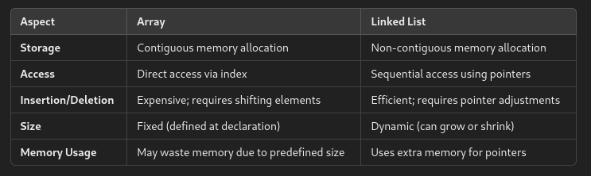
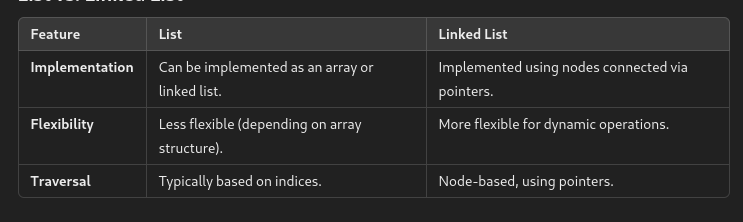

# Comparison of Array (Linked List)



# List and Linked List
- **List:**  
    A generic term for a collection of elements. Lists can be implemented using arrays or linked lists.
- **Linked List:**  
    A dynamic data structure where elements (nodes) are linked using pointers.
    


# Types of Linked List

#### 1. Singly Linked List

Nodes have data and a pointer to the next node. Traversal is one-directional.
```cpp
#include <iostream>
using namespace std;

struct Node {
    int data;
    Node* next;
    Node(int x) : data(x), next(nullptr) {}
};

void printList(Node* head) {
    while (head) {
        cout << head->data << " -> ";
        head = head->next;
    }
    cout << "NULL" << endl;
}

int main() {
    Node* head = new Node(10);
    head->next = new Node(20);
    head->next->next = new Node(30);
    printList(head);
    return 0;
}

```

#### 2. Doubly Linked List

Nodes have data, a pointer to the next node, and a pointer to the previous node. Supports bi-directional traversal.
```cpp
#include <iostream>
using namespace std;

struct Node {
    int data;
    Node* prev;
    Node* next;
    Node(int x) : data(x), prev(nullptr), next(nullptr) {}
};

void printList(Node* head) {
    while (head) {
        cout << head->data << " <-> ";
        head = head->next;
    }
    cout << "NULL" << endl;
}

int main() {
    Node* head = new Node(10);
    head->next = new Node(20);
    head->next->prev = head;
    head->next->next = new Node(30);
    head->next->next->prev = head->next;
    printList(head);
    return 0;
}

```

#### 3. Circular Linked List

The last node points back to the first node, forming a circular structure.
```cpp
#include <iostream>
using namespace std;

struct Node {
    int data;
    Node* next;
    Node(int x) : data(x), next(nullptr) {}
};

void printList(Node* head) {
    if (!head) return;
    Node* temp = head;
    do {
        cout << temp->data << " -> ";
        temp = temp->next;
    } while (temp != head);
    cout << "(back to head)" << endl;
}

int main() {
    Node* head = new Node(10);
    head->next = new Node(20);
    head->next->next = new Node(30);
    head->next->next->next = head; // Circular link
    printList(head);
    return 0;
}

```
## Polynomial Representation and Addition of Polynomial 

#### Polynomial Representation

Polynomials are stored in a linked list where each node contains:

- **Coefficient**
- **Exponent**
- **Pointer to the next term**

#### Polynomial Addition Algorithm

1. Traverse both polynomials.
2. Compare the exponents of current terms from both lists.
3. Add coefficients if exponents are equal; otherwise, copy the term with the larger exponent.
4. Advance to the next node in one or both lists.

```cpp
#include <iostream>
using namespace std;

struct PolyNode {
    int coeff, exp;
    PolyNode* next;
    PolyNode(int c, int e) : coeff(c), exp(e), next(nullptr) {}
};

void addPolynomial(PolyNode* p1, PolyNode* p2) {
    while (p1 && p2) {
        if (p1->exp > p2->exp) {
            cout << p1->coeff << "x^" << p1->exp << " + ";
            p1 = p1->next;
        } else if (p1->exp < p2->exp) {
            cout << p2->coeff << "x^" << p2->exp << " + ";
            p2 = p2->next;
        } else {
            cout << (p1->coeff + p2->coeff) << "x^" << p1->exp << " + ";
            p1 = p1->next;
            p2 = p2->next;
        }
    }
    while (p1) {
        cout << p1->coeff << "x^" << p1->exp << " + ";
        p1 = p1->next;
    }
    while (p2) {
        cout << p2->coeff << "x^" << p2->exp << " + ";
        p2 = p2->next;
    }
    cout << "0\n";
}

int main() {
    PolyNode* poly1 = new PolyNode(3, 2);
    poly1->next = new PolyNode(5, 1);

    PolyNode* poly2 = new PolyNode(4, 2);
    poly2->next = new PolyNode(6, 0);

    addPolynomial(poly1, poly2);
    return 0;
}

```