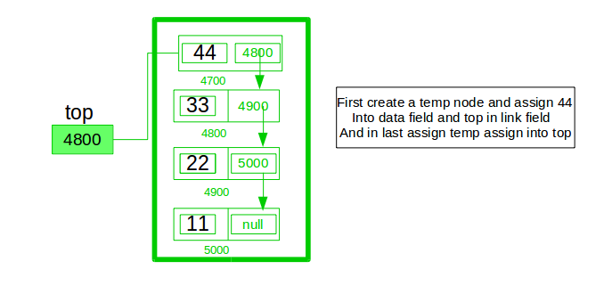
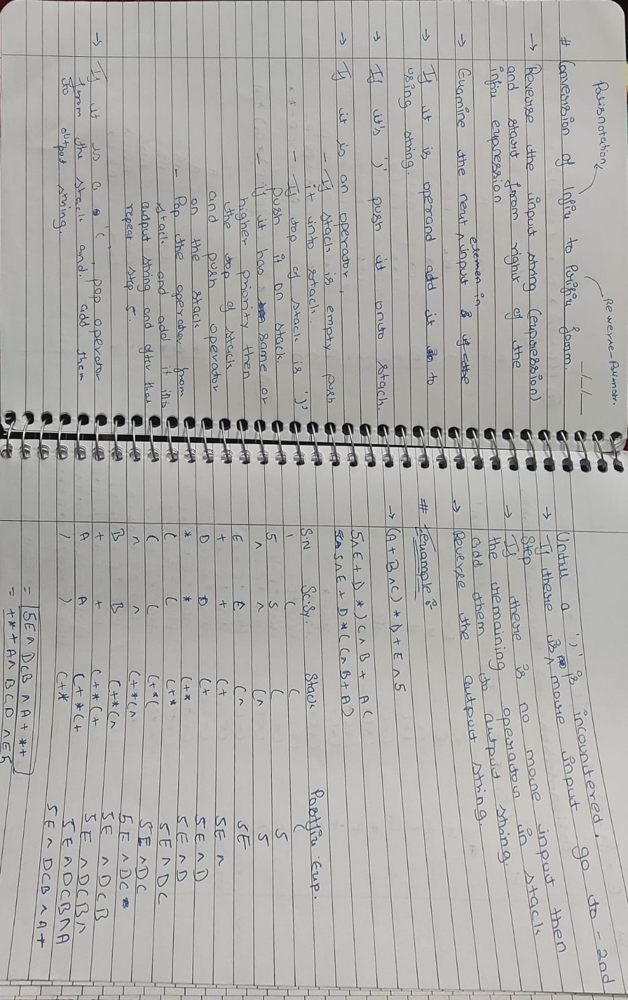
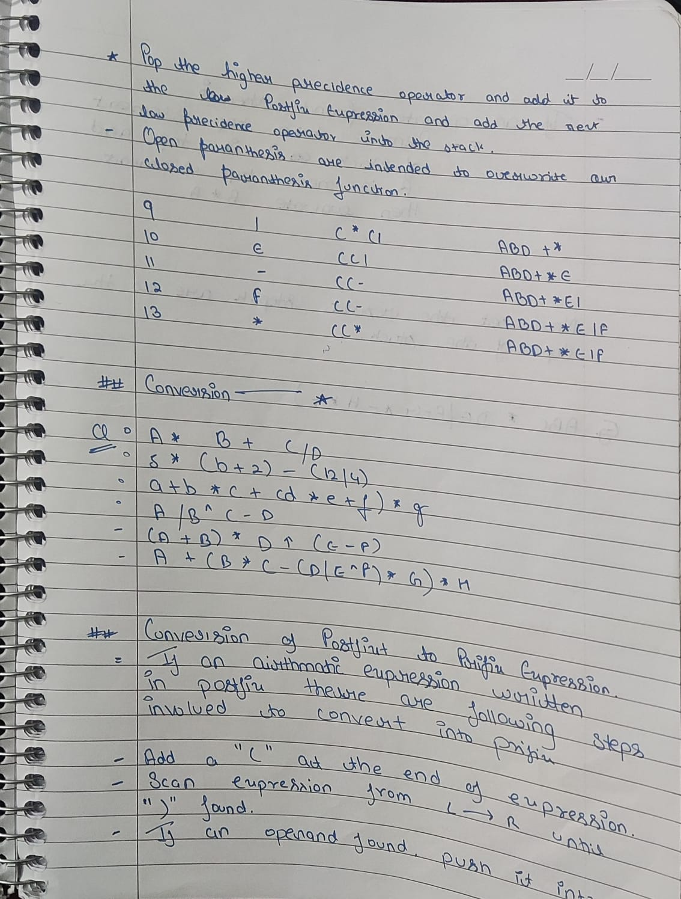
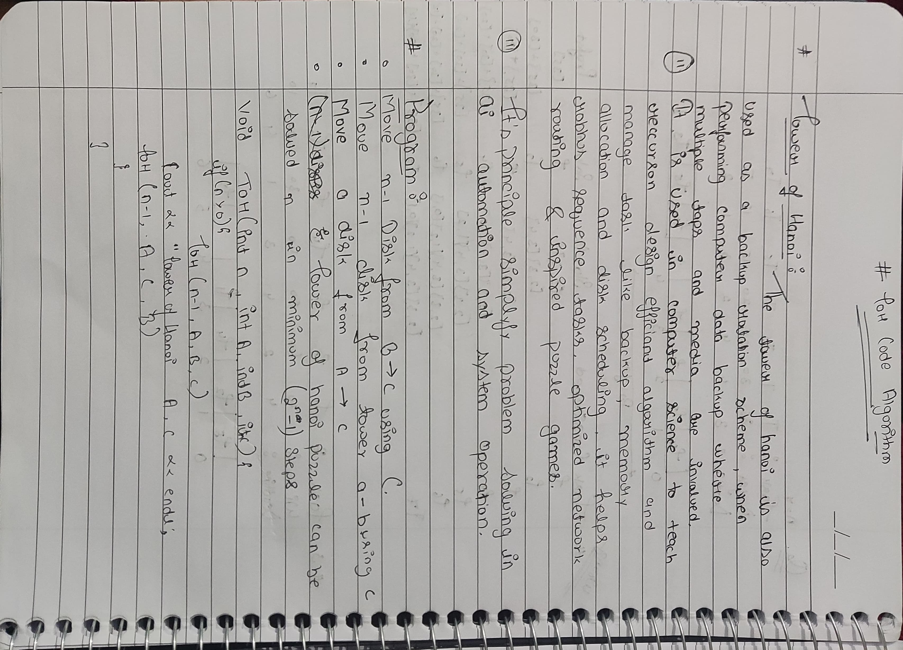
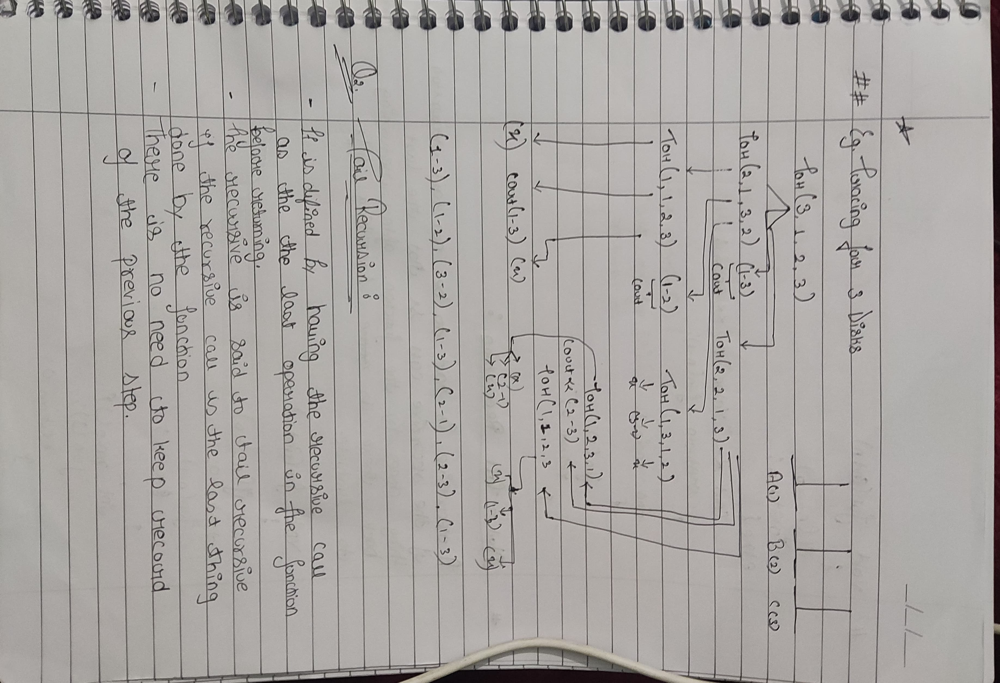
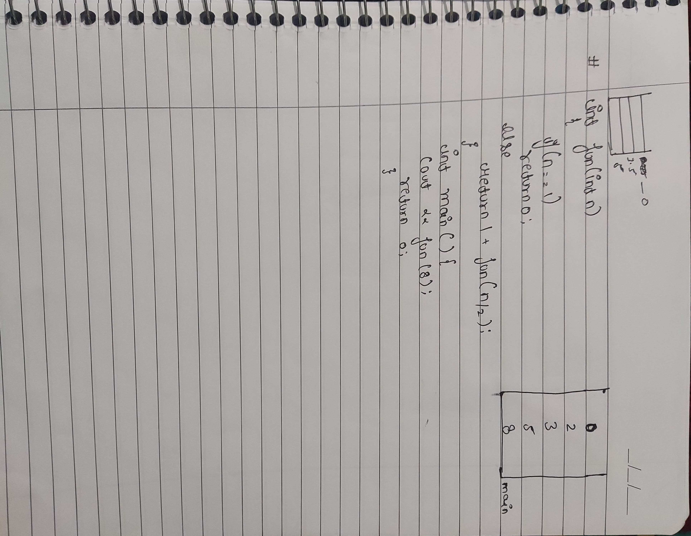

# Stacks
A stack is a linear data structure that follows the Last-In-First-Out (LIFO) principle. It operates like a pile of plates, where the last plate placed on top is the first one removed.
## Primitive Stack Operations
- **Push:** Adds an element to the top of the stack.
- **Pop:** Removes and returns the element from the top of the stack.
### Array & Linked List Implementation
- An array is used to store the elements.
- A `top` variable keeps track of the index of the top element.
 


```cpp
#include <iostream>
#include <stack>
using namespace std;

int precedence(char op) {
    if (op == '+' || op == '-') return 1;
    if (op == '*' || op == '/') return 2;
    return 0;
}

string infixToPostfix(string infix) {
    stack<char> st;
    string postfix = "";
    for (char ch : infix) {
        if (isalnum(ch)) postfix += ch;
        else if (ch == '(') st.push(ch);
        else if (ch == ')') {
            while (!st.empty() && st.top() != '(') {
                postfix += st.top(); st.pop();
            }
            st.pop();
        } else {
            while (!st.empty() && precedence(st.top()) >= precedence(ch)) {
                postfix += st.top(); st.pop();
            }
            st.push(ch);
        }
    }
    while (!st.empty()) { postfix += st.top(); st.pop(); }
    return postfix;
}

int main() {
    string infix = "(A+B)*C";
    cout << "Postfix: " << infixToPostfix(infix) << endl;
    return 0;
}

```

**LinkedList**:
- Each node in the linked list represents an element.
- The `top` pointer points to the topmost node.


## Application of Stack
- **Function Calls:** Keeps track of function calls and return addresses.
- **Expression Evaluation:** Converts infix expressions to postfix or prefix and evaluates them.
- **Backtracking:** Used in algorithms like maze solving and game playing.
- **Undo/Redo Functionality:** Stores previous states for undoing or redoing actions.
### Infix, Prefix, Postfix Expressions
- **Infix:** Operators are placed between operands (e.g., `a + b`).
- **Prefix:** Operators precede operands (e.g., `+ a b`).
- **Postfix:** Operators follow operands (e.g., `a b +`).



## Recursion
Recursion is a programming technique where a function calls itself directly or indirectly.
### Principles of Recursion
- **Base Case:** A simple case that can be solved directly.
- **Recursive Case:** Breaks down the problem into smaller subproblems and calls itself to solve them.
### Tail Recursion
A recursive function is tail-recursive if the recursive call is the last operation in the function. Tail-recursive functions can be optimized by compilers to use iterative techniques.
### Removal of Recursion
Recursion can be removed using iterative techniques like loops or using a stack to simulate the recursion.
### Problem solving using iteration and recursion
### Binary search 
- **Recursive:** Divide and conquer approach.
- **Iterative:** Use a loop to check the middle element and adjust the search range.
```cpp
#include <iostream>
using namespace std;

int binarySearch(int arr[], int low, int high, int key) {
    while (low <= high) {
        int mid = low + (high - low) / 2;
        if (arr[mid] == key) return mid;
        else if (arr[mid] < key) low = mid + 1;
        else high = mid - 1;
    }
    return -1;
}

int main() {
    int arr[] = {10, 20, 30, 40, 50};
    cout << "Key found at: " << binarySearch(arr, 0, 4, 30) << endl;
    return 0;
}

```
### Fibonacci series
- **Recursive:** Direct recursive definition.
- **Iterative:** Use a loop to calculate the next Fibonacci number.

```cpp
#include <iostream>
using namespace std;

int fibonacci(int n) {
    if (n <= 1) return n;
    return fibonacci(n - 1) + fibonacci(n - 2);
}

int main() {
    for (int i = 0; i < 10; i++) cout << fibonacci(i) << " ";
    return 0;
}

```
## Tower of Hanoi
- **Recursive:** Break down the problem into smaller subproblems.
- **Iterative:** Use a stack to simulate the recursive calls.



### Trade-offs between iteration and recurssion
- **Readability:** Recursion can often be more intuitive, but iteration can be more straightforward.
- **Efficiency:** Recursive functions can have overhead due to function calls, while iterative solutions can be more efficient.
- **Memory Usage:** Recursive functions can use more stack space, while iterative solutions typically use less.
## Merge sort & Quick sort algorithms with analysis
- **Merge Sort:**
    - Divide the array into two halves.
    - Recursively sort the two halves.
    - Merge the sorted halves.
- **Quick Sort:**
    - Choose a pivot element.
    - Partition the array into two subarrays: elements less than the pivot and elements greater than the pivot.
    - Recursively sort the two subarrays.
> Proceed to [05_Module](05_Module)
# Array and Linked List implementation of Queues
A queue is a linear data structure that follows the First-In-First-Out (FIFO) principle. It operates like a queue of people waiting for a service.

**Array Implementation**
- Use an array to store the elements.
- Two pointers, `front` and `rear`, keep track of the front and rear of the queue.


```cpp
#include <iostream>
using namespace std;

class Queue {
    int *arr, front, rear, capacity;
public:
    Queue(int size) : capacity(size), front(0), rear(0) { arr = new int[capacity]; }
    ~Queue() { delete[] arr; }
    void enqueue(int x) {
        if (rear == capacity) { cout << "Queue Overflow\n"; return; }
        arr[rear++] = x;
    }
    int dequeue() {
        if (front == rear) { cout << "Queue Underflow\n"; return -1; }
        return arr[front++];
    }
};

int main() {
    Queue q(5);
    q.enqueue(10); q.enqueue(20);
    cout << "Dequeue: " << q.dequeue() << endl;
    return 0;
}

```

**Linked List Implementation:**

- Use a linked list to store the elements.
- The `front` and `rear` pointers point to the front and rear nodes of the queue.

## Operations in Queues
1. **Enqueue:** Adds an element to the rear of the queue.
3. **Dequeue:** Removes and returns the element from the front of the queue. 3. **IsFull:** Checks if the queue is full.  
4. **IsEmpty:** Checks if the queue is empty.
### Circular queues
A circular queue is a queue implementation where the rear pointer wraps around to the front when the queue is full. This allows efficient use of the array.
### Dequeue and Priority Queue algorithms with analysis
- **Dequeue:** A double-ended queue allows insertion and deletion from both ends.
- **Priority Queue:** Elements are inserted with a priority, and the highest-priority element is always at the front.