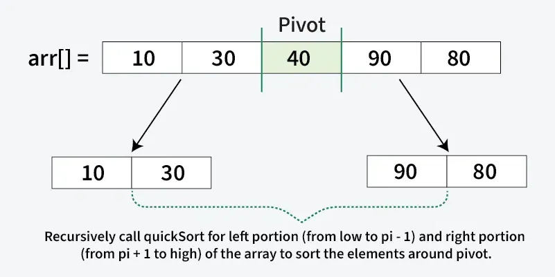
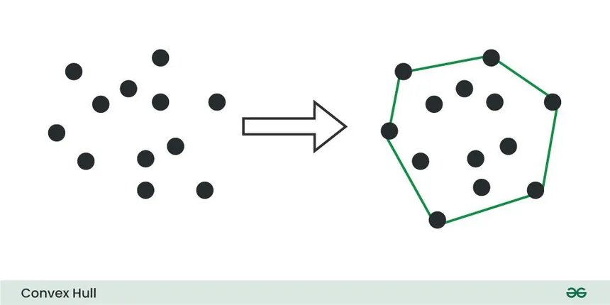
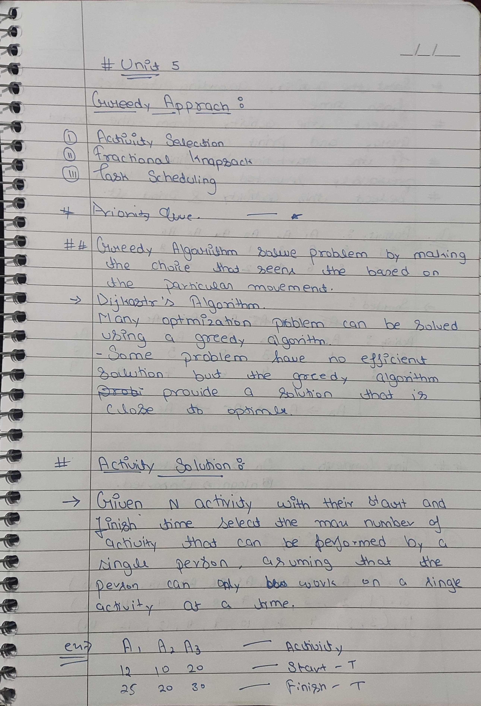
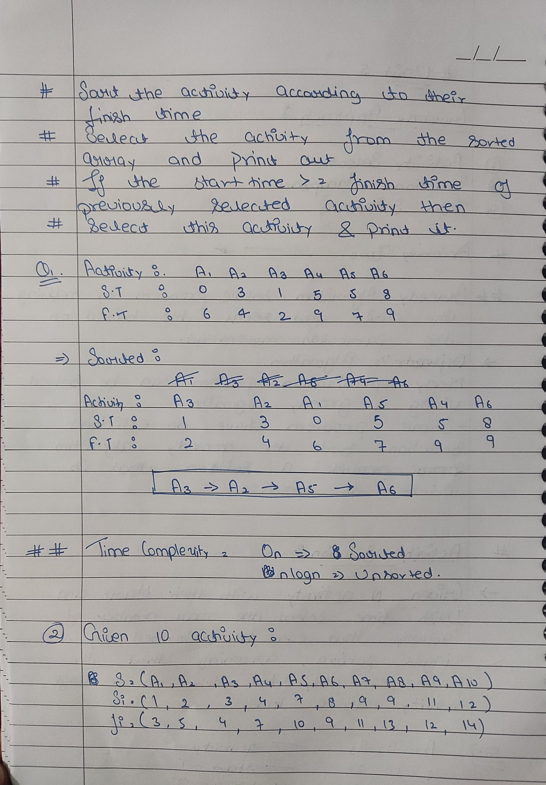
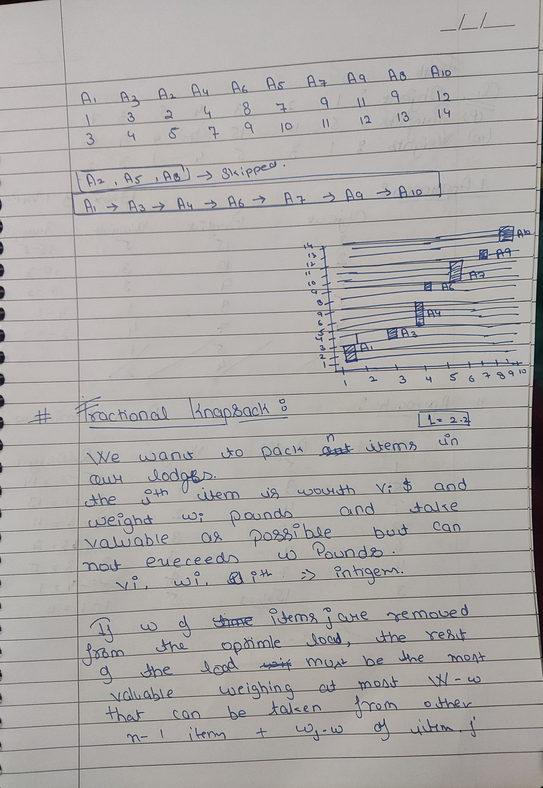
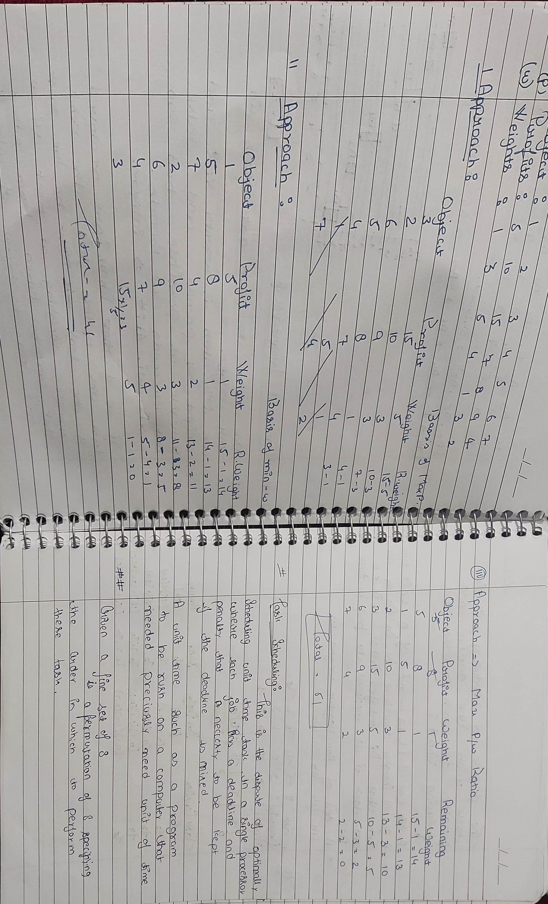
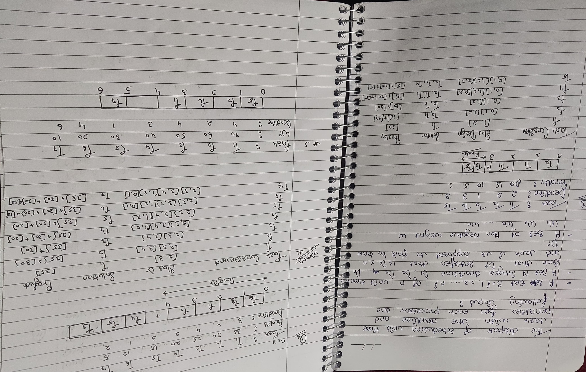

# Divide and Conquer Concepts
Divide and Conquer is an algorithm design paradigm based on recursively breaking a problem into smaller subproblems, solving each independently, and combining their results.
#### Steps
1. **Divide:** Break the problem into smaller, independent subproblems.
2. **Conquer:** Solve each subproblem recursively.
3. **Combine:** Merge solutions of subproblems to solve the original problem.
#### Advantages
- Efficient for large problems (e.g., sorting, searching).
- Facilitates parallelism in computations.
#### Applications
- Sorting algorithms (Quick Sort, Merge Sort).
- Computational Geometry (Convex Hull).
- Numerical algorithms (Fast Fourier Transform).
## Quick Sort
Quick Sort is a **divide-and-conquer** algorithm that partitions the array around a pivot element and recursively sorts the subarrays.

1. **Partition Step:** Rearrange elements such that:
    - Elements less than the pivot are on the left.
    - Elements greater than the pivot are on the right.
2. **Recursive Step:** Sort the left and right subarrays.
#### **Time Complexity**

- **Best/Average Case:** O(n log⁡ n).
- **Worst Case:** O(n^2).



```cpp
#include <iostream>
using namespace std;

int partition(int arr[], int low, int high) {
    int pivot = arr[high];
    int i = low - 1;
    for (int j = low; j < high; j++) {
        if (arr[j] <= pivot) {
            swap(arr[++i], arr[j]);
        }
    }
    swap(arr[i + 1], arr[high]);
    return i + 1;
}

void quickSort(int arr[], int low, int high) {
    if (low < high) {
        int pi = partition(arr, low, high);
        quickSort(arr, low, pi - 1);
        quickSort(arr, pi + 1, high);
    }
}

int main() {
    int arr[] = {10, 7, 8, 9, 1, 5};
    int n = sizeof(arr) / sizeof(arr[0]);
    quickSort(arr, 0, n - 1);
    for (int i = 0; i < n; i++) cout << arr[i] << " ";
    return 0;
}

```

## Merge Sort
Merge Sort is another **divide-and-conquer** sorting algorithm:

1. **Divide:** Split the array into two halves.
2. **Conquer:** Recursively sort each half.
3. **Combine:** Merge the two sorted halves into one.

**Time Complexity:** 
**Best/Average/Worst Case:** O(n log⁡ n)


```cpp
#include <iostream>
using namespace std;

void merge(int arr[], int l, int m, int r) {
    int n1 = m - l + 1, n2 = r - m;
    int L[n1], R[n2];
    for (int i = 0; i < n1; i++) L[i] = arr[l + i];
    for (int i = 0; i < n2; i++) R[i] = arr[m + 1 + i];
    int i = 0, j = 0, k = l;
    while (i < n1 && j < n2) arr[k++] = (L[i] <= R[j]) ? L[i++] : R[j++];
    while (i < n1) arr[k++] = L[i++];
    while (j < n2) arr[k++] = R[j++];
}

void mergeSort(int arr[], int l, int r) {
    if (l < r) {
        int m = l + (r - l) / 2;
        mergeSort(arr, l, m);
        mergeSort(arr, m + 1, r);
        merge(arr, l, m, r);
    }
}

int main() {
    int arr[] = {12, 11, 13, 5, 6, 7};
    int n = sizeof(arr) / sizeof(arr[0]);
    mergeSort(arr, 0, n - 1);
    for (int i = 0; i < n; i++) cout << arr[i] << " ";
    return 0;
}
```
## Convex Hull
The **Convex Hull** of a set of points is the smallest convex polygon that encloses all the points.

1. **Problem Statement:** Given a set of points in a plane, find the convex hull.
2. **Algorithm:**
    - Sort points by x-coordinate.
    - Use algorithms like **Graham’s Scan** or **Jarvis March**.

**Time Complexity:**
- **Best Case:** O(n log⁡ n)



```cpp
#include <iostream>
#include <vector>
#include <algorithm>
using namespace std;

struct Point { int x, y; };
Point p0;

int orientation(Point p, Point q, Point r) {
    int val = (q.y - p.y) * (r.x - q.x) - (q.x - p.x) * (r.y - q.y);
    return (val == 0) ? 0 : (val > 0) ? 1 : 2;
}

bool compare(Point p1, Point p2) {
    int o = orientation(p0, p1, p2);
    if (o == 0) return (p1.x < p2.x);
    return (o == 2);
}

void convexHull(vector<Point> points) {
    sort(points.begin(), points.end(), [](Point a, Point b) { return a.y < b.y; });
    p0 = points[0];
    sort(points.begin() + 1, points.end(), compare);
    cout << "Convex Hull Points: ";
    for (auto &p : points) cout << "(" << p.x << ", " << p.y << ") ";
}

int main() {
    vector<Point> points = {{0, 3}, {2, 2}, {1, 1}, {2, 1}, {3, 0}};
    convexHull(points);
    return 0;
}

```
# Greedy Methods 
**Greedy algorithms** build solutions step-by-step by choosing the most optimal option at each stage without considering the global solution.







