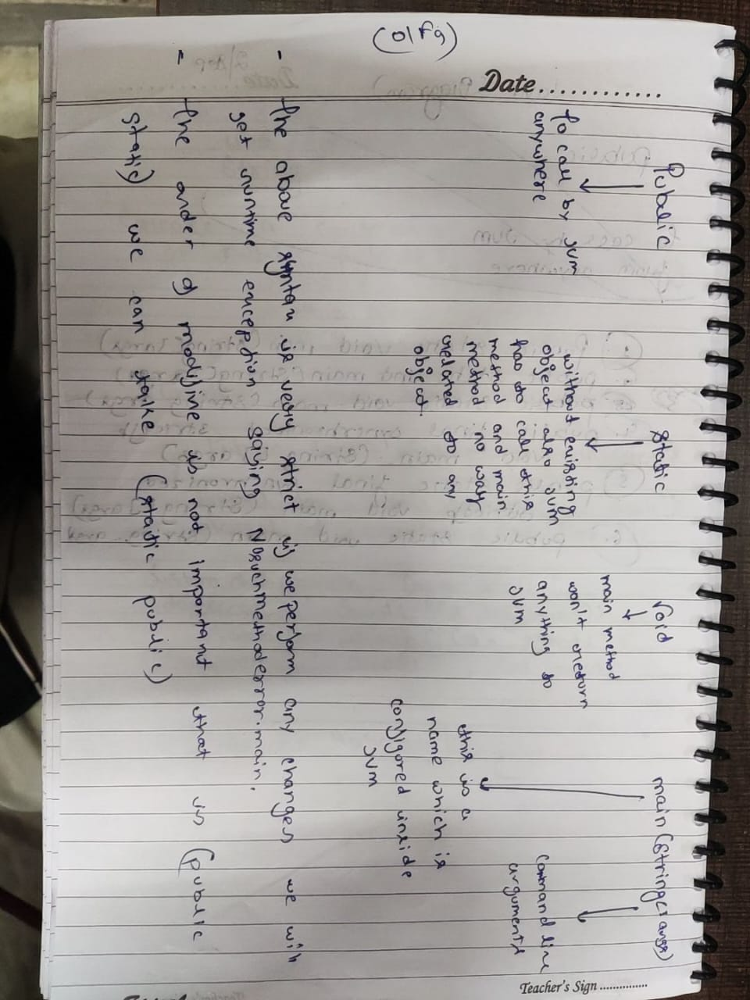
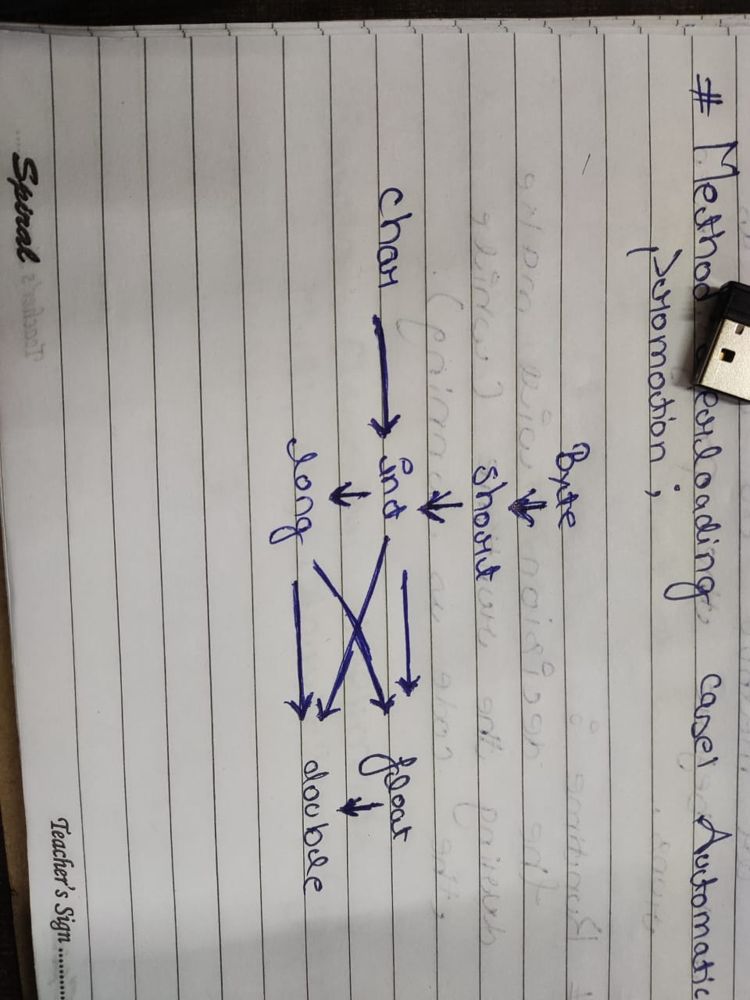
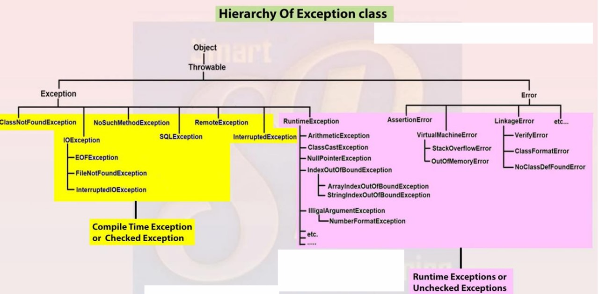

# Basics
1. Weather class contains main() method or not and weather main() method is declared according to requirements or not these things won't checked by compiler. At runtime, JVM is responsible to check these things.

- All runtime if JVM is unable to find required main() method then we will get runtime exception saying `NoSuchMethodError.main`

```java
class Test{
}
java Test.java
java Test
RuntimeException : NoSuchMethodError.main
```


2. We can declare `'String[]'`  in any acceptable form.
- `main(String []args)`
- `main(String[] args)`
- `main (String args[])`

3. Instead of `'args'` we can take any valid java identifier.

4. We can declare main() method with the following modifiers also.
- `final`
- `synchronized `
- `strictfp`

```java
class Test{
final static synchronized strictfp public void main(string args[]){
sopen("void main");
}
}
javac Test.java
java Test
output void main
```
### Modifiers (Access Modifiers)
- Public : It's a park which can be accessed by anyone in game (Class);
- Private : It's like a hideout which can be accessed only by same team members (same class members);
- Protected : It's like a GTA online Closed friends server;
- Default : Everyone in the package can easily access this.

### Packages
Packages are like folders which contains a specific assigned part of your code.
- Helps you code readability
- Increase maintainability l
- Avoided name conflicts

### Method to run Java Files on Command line
```
- javac FileNameHere.java           //Will make a class compile form

- java FileNameHere                 // Will exicute the file directly here

```
## String Buffer 
The `StringBuffer` allows you to modify the description without creating entirely new strings each time, making it efficient for building complex descriptions.
> It's like a character from game Detroit where every charcter's backstory is blank and will update as you progress and make choices.
#### Commands to use StringBuffer
- `.append();`
- `.insert();`
## Method Overloading & Overriding

### Overloading
Method Overloading is where we use same method with different parameters.
-  Same Name 
- With same class 
- Different Arguments 
- Sequence of Arguments
- Types of Arguments 
```java
class Player {
    void attack() { 
        System.out.println("Basic punch!"); 
    }

    void attack(String weapon) { 
        System.out.println("Attack with " + weapon + "!");
    }

    void attack(int powerLevel) {
        System.out.println("Supercharged attack with power level " + powerLevel + "!");
    }
}
```

### Overriding
Method Overriding is where we use same methods and parameters and the override the functions for that perticular class.
- Same Name 
- Diffrent Class
- Same Arguments
- Number of Arguments
- Type of Argumetns
- Sequence of Arguments
- IS-A Relationship


```java
class Character {
    void move() { 
        System.out.println("Generic movement"); 
    }
}

class Ninja extends Character {
    @Override 
    void move() {
        System.out.println("Ninja vanishes in a puff of smoke!"); 
    }
}

class Wizard extends Character {
    @Override
    void move() {
        System.out.println("Wizard teleports!");
    }
}
```
## Constructers
```java
 package Firstapp;                      // Package Name

public class Student {
	public static void Dance() {
		System.out.println("Nacchiiiiii");
	}

	public static void main(String[] args) {
	   Student alex=new Student();
	   alex.Dance();
	}

}
```
### Default Constructors 
```java
class Hero {
    String name;
    int health;
    int strength;
    String weapon;

    // Default Constructor
    public Hero() {
        this.name = "New Hero";
        this.health = 100;
        this.strength = 10;
        this.weapon = "Wooden Sword";
    }

    public void displayStats() {
        System.out.println("Name: " + name);
        System.out.println("Health: " + health);
        System.out.println("Strength: " + strength);
        System.out.println("Weapon: " + weapon);
    }
}

public class Main {
    public static void main(String[] args) {
        // Creating a new hero using the default constructor
        Hero defaultHero = new Hero(); 
        defaultHero.displayStats(); 
    }
}
```
```java
public class Main {
    public static void main(String[] args) {
        // Creating a new hero using the default constructor
        Hero defaultHero = new Hero(); 
        defaultHero.displayStats(); 

        // Creating a new hero using the parameterized constructor
        Hero customHero = new Hero("Braveheart", 120, 15, "Iron Sword");
        customHero.displayStats();
    }
}
```
- Constructors does not have any return type.
- Exicutes automatically when we create a object.

### Input parameterized constructors
In order to make a program with both default and input parameterized constructor we either use ternory operators or (`Integer.parseInt();` -> It is used to convert string input into integer).
> We need to check input from user weather is empty or not so we use `VariableInput.isEmpty();`
```java
import java.util.*;
class Character {
    String name;
    String charClass;
    int level;
    int healthPoints;
    int manaPoints;

    // Default Constructor (Quick Start)
    public Character() {
        this.name = "Adventurer";
        this.charClass = "Warrior";
        this.level = 1;
        this.healthPoints = 100;
        this.manaPoints = 0; 
    }

    // Parameterized Constructor (Custom Character)
    public Character(String name, String charClass, int level, int healthPoints, int manaPoints) {
        this.name = name;
        this.charClass = charClass;
        this.level = level;
        this.healthPoints = healthPoints;
        this.manaPoints = manaPoints;
    }

    public void displayInfo() {
        System.out.println("Name: " + name);
        System.out.println("Class: " + charClass);
        System.out.println("Level: " + level);
        System.out.println("Health Points: " + healthPoints);
        System.out.println("Mana Points: " + manaPoints);
    }
}

public class Merge {
    public static void main(String[] args) {
        Scanner scanner = new Scanner(System.in);

        System.out.print("Enter character name (or press Enter for default): ");
        String name = scanner.nextLine();

        System.out.print("Enter character class (or press Enter for default): ");
        String charClass = scanner.nextLine();

        System.out.print("Enter character level (or press Enter for default): ");
        String levelInput = scanner.nextLine();
        int level = levelInput.isEmpty() ? 1 : Integer.parseInt(levelInput); // Default to 1 if empty
        System.out.print("Enter health points (or press Enter for default): ");
        String healthInput = scanner.nextLine();
        int healthPoints = healthInput.isEmpty() ? 100 : Integer.parseInt(healthInput); // Default to 100

        System.out.print("Enter mana points (or press Enter for default): ");
        String manaInput = scanner.nextLine();
        int manaPoints = manaInput.isEmpty() ? 0 : Integer.parseInt(manaInput); // Default to 0

        // Create character based on input
        Character character;
        if (name.isEmpty() && charClass.isEmpty()) {
            character = new Character(); // Use default constructor if no name or class provided
        } else {
            character = new Character(name, charClass, level, healthPoints, manaPoints);
        }

        System.out.println("\nCreated Character:");
        character.displayInfo();

        scanner.close();
    }
}
```
## Input in Java
It is important to close scannes in java using `scanner.close();`

```java
import java.util.Scanner;  // Import the Scanner class

class Main {
  public static void main(String[] args) {
    Scanner myObj = new Scanner(System.in);  // Create a Scanner object
    System.out.println("Enter username");

    String userName = myObj.nextLine();  // Read user input
	int num = myObj.nextInt(); 			// Read Input as Integer
    System.out.println("Username is: " + userName);  // Output user input
    myObj.close();
  }
}
```
### Rule Switch
```java
int dayOfWeek = 3;
String dayType = switch (dayOfWeek) {
    case 1, 7 -> "Weekend";
    case 2, 3, 4, 5, 6 -> "Weekday";
    default -> "Invalid day";
};
```

# OOPs
### Class &Objects
Class is a blueprint for the data which does not occupy any spaces in memory.
Objects are the entities of class which are stored under class.

# Principals of OOPs
## Abstraction
> A method withoud no body and implimentation is Abstraction
 - A method must always be declared in an abstract class or we can say if class an abstract method it should declared abstract as well.
 - If a regular class extends an abstract class then the class must have to impliment all the abstract methods in abstract parent class or it has to be declared as abstrect.
 - Abstract class cannot be instancesiated, we can not create an object of abstraction class.
 - Concrete Subclass - Class created using extending an abstract class and allows you to create objects
 - Super keyword is used to call constructers, methods and variables (variables must not be private).
 ```java
abstract class NPC{
    abstract void start();
}
class Player extends NPC{
    void start(){
        System.out.println("Started");
    }
}
class Character extends NPC{
    void start(){
        System.out.println("Start's Car");
    }
    public static void main(String[] args) {
        Character x=new Character();
        Player y = new Player();
        x.start(); 
        y.start(); 
    }
}
```
## Accesibity Table                             
- Private 
- Public 
- Protected
- Default

## Polymorphism
Polymorphism is like having different game characters (like enemies) perform the same action (like attacking) in their own unique way. In programming, this means different objects can respond to the same message or function call in a way that's specific to their type. It allows for flexibility and adaptability in code
### Types of Polymorphism 
#### Runtime Polymorphism
#### Dynamic Polymorphism

## Inheritance
> Inheritance is inhariting the properties of parent class into child class
- Inheritance in java is a mechinism in which one object aquires all the properties and behaviors of the parent object.
- Inheritance represents the IS-A relationship which is known as parent child relationship.

#### Advantanges of Inheritance 
- Code reusebility 
- It propose run time polymorphism by allowing mehthod overriding.
#### Disadvanatges of Inheritance 
- Using inhertance two class (Parent and child classes) gets tightly coupled.

#### Important Points
- Inheritance is achieved by `extend` keyword.
- every class has a super or parent class that is object class (The object class doesn't have any parent class).

## Types of Inheritance 
- Single Inheritance
```java
class Character{

}
class Player extends Character{

}
```
### Multilevel Inheritance
```java
class Pokemon {
    String type;

    public Pokemon(String type) {
        this.type = type;
    }
}

class Pikachu extends Pokemon {
    public Pikachu() {
        super("Electric"); 
    }

    void thunderbolt() {
        System.out.println("Pikachu used Thunderbolt!");
    }
}

class Raichu extends Pikachu {
    void thunder() {
        System.out.println("Raichu used Thunder!");
    }
}
class MultilevelInheritance{
    public static void main(String[] args) {
        Raichu Kid = new Raichu();
        Kid.thunderbolt();
    }
}
```
### Herarical Inheritance
```java
class Creature {
    String habitat;

    public Creature(String habitat) {
        this.habitat = habitat;
    }
}

class Dragon extends Creature {
    public Dragon() {
        super("Mountains"); 
    }

    void breatheFire() {
        System.out.println("Dragon breathes fire!");
    }
}

class Unicorn extends Creature {
    public Unicorn() {
        super("Forests"); 
    }

    void heal() {
        System.out.println("Unicorn uses healing magic!");
    }
}
class Hierarchical_Inheritance{
    public static void main(String[] args) {
        Unicorn N = new Unicorn();
        N.heal();
        Dragon X = new Dragon();
        X.breatheFire();
    }
}
```
### Multiple Inheritance 
```java
interface Warrior {
    void swingSword();
    void blockAttack();
}

interface Mage {
    void castSpell();
    void meditate();
}

class HybridHero implements Warrior, Mage {
    

    @Override
    public void swingSword() {
        System.out.println("Hero swings their mighty sword!");
    }

    @Override
    public void blockAttack() {
        System.out.println("Hero skillfully blocks an incoming attack!");
    }

    @Override
    public void castSpell() {
        System.out.println("Hero unleashes a powerful spell!");
    }

    @Override
    public void meditate() {
        System.out.println("Hero focuses their mind, restoring mana.");
    }
}

public class multipalinheri { 
    public static  void main(String[] args) {
        HybridHero Alone = new HybridHero();
        Alone.castSpell();
        Alone.swingSword();
    }
}
```
### Hybrid Inhertance
```java
class Human {
    void fight() {
        System.out.println("Engages in hand-to-hand combat!");
    }
}

interface Robot {
    void enhanceStrength();
}

class Cyborg extends Human implements Robot {
    @Override
    public void enhanceStrength() {
        System.out.println("Strength enhanced by cybernetics!");
    }
}
public class HybridInheritance {
    public static void main(String[] args) {
        Cyborg n = new Cyborg();
        n.enhanceStrength();
        n.fight();
    }
}
```
## Super Keyword
Super keyword is a refrence variable it is used to reffer to imidiate parent class or current sub class. `super()`
> Used where a subclass inherits properties and behaviors from its superclass
### Use cases of Super 
- Calling a Superclass constructor
```java
class Animal {
    Animal() {
        System.out.println("Animal is created");
    }
}

class Dog extends Animal {
    Dog() {
        super(); // Call the parent class constructor
        System.out.println("Dog is created");
    }
}
```
- Calling a supperclass method
```java
class Animal {
    void eat() {
        System.out.println("Animal is eating");
    }
}

class Dog extends Animal {
    void eat() {
        super.eat(); // Call the parent class method
        System.out.println("Dog is eating");
    }
}
- Acessing a superclass variable
```java
class Animal {
    String color = "brown";
}

class Dog extends Animal {
    String color = "black";

    void printColor() {
        System.out.println(color);   // Prints "black"
        System.out.println(super.color); // Prints "brown"
    }
}
```

# Exception Handling 
- If the superclass(parent) overrided meathod does not throws an exception, subclass overriding method can only throws the unchecked exceptions, Throwing checked exception will lead to compile time error.
- If superclass overriden method does throws an exception, subclass overriding method can only throw same, subclass exception.
- Throwing parent exception in exception hirrarchy will lead to compile time error. Also there is no issue if subclass overriden method is not throwing any exception.



- Invoking overridden method, we can call parent class method in overriding method using `super()` keyword.
- If you don't want a method to be overwritten we declare it as a `final`.
- (Method overriding versus method Hiding) When you define a static method with same signature as a static method in the base class it is known as method hiding.
> Static method can not be overridden.
- overriding and syncronized / strictfp method.

## Compiletime Exception Error (Checked)
### Types of Checked Exception
1. IOException
- FileNotFoundException
- EOFException
2. SQLException
3. ClassNotFoundException
4. IntruptedException
## Runtime Exception Error (Unchecked)
### Types of Unchecked Exception
1. NullPointerException
2. ArrayIndexOutOfBondsException
3. ArithmaticException
4. IllegalArgumentException
5. NumberFoormatException
6. ClassCastException
## Errors
1. OutOfMemoryError
2. StackOverFlowError
3. VirtualMachineError

### Finally
- `Finally` keyword is used to run iportant code regardless of the exceptions.
- Used to put important code such as cleanup codes and closer codes which are needed anyway regardless of any try-catch results.

# Array
Array is a collection of items with same data type, it's a continues type of data structure.
To initilize an array we use `ArrayName[]` syntax.
## Advantages of an Array
- We can access any element randomly by using indexs provided by array.
- We can access using synatx : s`System.out.println("Your inventory: " + Arrays.toString(letters));`
- Array can be used to store other data structures like trees, linkedlist, heap, stack, queues.
## Disadvantages
- Fixed Size, we need to mention the size of an array.
- When array is created, size can not be changed.
- Memory wastage, there is alot of chances of memory wastage. ie: Suppose we created an array of length 100 but only 10 elemets are insterted then 90 blockes are empety thus memory wastage.
- Strongly type, Array stores any similar data type thus strongly type.
- int a[5]; a[0] = 7;....a[4] = 8;`

# Lambda Expression 
- To enable functional programming in java
- To make code more readible, maintainable and consize code.
- Zar file size reduction.
-  Elimnation of shadow variable.
### Functional Interface
Interfaces which containes only one abstract method.

