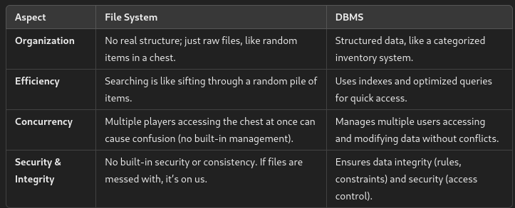
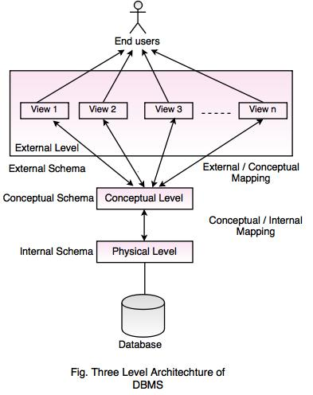

# Basics
#### Definition
A **DBMS (Database Management System)** is like a game engine, but for data. Instead of manually handling files and records (like raw game assets), a DBMS **organizes, stores, retrieves, and secures** data efficiently.
#### Importance
A **massive open-world RPG** with thousands of NPCs, quests, items, and interactions.
Without a DBMS, every interaction would be manually handled, making it slow, chaotic, and prone to crashes. A DBMS acts like the **game’s backend system**, ensuring:

1. **Data is organized** → Just like an inventory system categorizes weapons, potions, and armor.  
2. **Security & Access Control** → Prevents unauthorized players (hackers) from stealing in-game currency.  
3. **Speed Optimization** → Uses indexing and caching, just like how games use LOD (Level of Detail) for performance.  
4. **Multiplayer Support** → Enables multiple users (players) to interact with the same world without conflicts.
#### Applications
- **MMORPGs & Multiplayer Games** – Handles player profiles, leaderboards, in-game transactions.
- **E-commerce (Like a Game Shop)** – Manages product listings, user accounts, and order history.
- **Banking (In-Game Economy)** – Tracks gold, loot, transactions, and prevents fraud.
- **Social Media (Guild & Chat Systems)** – Stores messages, friend lists, and user interactions.
- **Game Analytics (Player Stats & AI Learning)** – Logs player behavior to improve game balance.
>[!warning]
>🫣 Ignore the game analogies, just my way of understanding stuff

---
# DBMS vs File System
#### **File System = Your Old School RPG Inventory**

Imagine playing an old-school RPG. We have a huge chest to store items—swords, potions, armor. But here's the catch: everything is thrown in randomly. There is no system, no categories, and when we need that health potion in a hurry, we have to dig through everything. If someone else is also accessing the chest at the same time, there's a risk of items getting mixed up or lost.

Now, The **File System** is old-school RPG inventory. It stores everything (files), but it lacks organization and management. It doesn’t know what’s inside, and we have to do all the work of finding and organizing things manually. There's also no guarantee that multiple players can access the chest without messing things up.

#### **DBMS = A Fully Organized Inventory System with Rules**

Now imagine a modern RPG where we have a smart inventory system. It organizes items into categories like weapons, armor, potions, and quest items (Solo leveling kind of Stuff). The system knows exactly what each item is, and we can easily search for and access them. It ensures that two players can't grab the same item at the same time and causes no conflicts. Plus, the system keeps track of any changes or transactions.

A **DBMS** is like that organized inventory system. It doesn’t just store data (like files); it knows the structure, enforces rules, and can manage data efficiently. It provides things like:

- **Access control**: Only authorized players can access certain items.
- **Data consistency**: If we sell a sword, it updates the inventory right away.
- **Querying**: We can easily search for and retrieve items, even from a massive collection.

#### Differences

---
# Data Models
#### **1. Hierarchical Model = A Tree of Quests**

Imagine a game where quests are organized in a **tree structure**. We have a main quest at the top, and from there, multiple sub-quests branch off. Each sub-quest could have its own smaller quests, creating a clear hierarchy.

- **Structure**: Data is arranged in a tree, where each "parent" can have multiple "children," but each "child" can have only one "parent."
- **Example**: Think of the main story quest, with side quests branching off beneath it.
- **Limitation**: It’s rigid—once a quest is part of a branch, it can’t easily move around without breaking the structure.
#### **2. Network Model = A Web of Connected Allies**

Now, let’s imagine a game with multiple factions or groups of allies, where each ally can be part of several different groups, and each group might have different allies. This is more flexible than the hierarchical model because an ally can belong to multiple groups at once.

- **Structure**: Data is organized in a graph, where each "node" (e.g., an ally) can be connected to many other nodes, creating many-to-many relationships.
- **Example**: A character could be part of several factions or guilds in the game.
- **Limitation**: While more flexible than hierarchical, it can get complicated to manage all the relationships between different data points.
#### **3. Relational Model = A Spreadsheet of Stats**

In a **relational model**, think of a game’s **character stats** stored in multiple tables: one for characters, one for items, one for abilities. Each table has **rows** (records) and **columns** (attributes). Tables are linked using keys, like a character’s ID linking to their items or abilities.

- **Structure**: Data is stored in tables (like a spreadsheet), and relationships between tables are managed using **keys** (like character ID linking to items they own).
- **Example**: Characters in one table, items in another, and we can use IDs to relate them.
- **Advantage**: Easy to query and update data, and very flexible for organizing lots of data.
- **Limitation**: As the game world grows, performance can degrade if not properly optimized (like too many complex queries).
#### **4. Object-Oriented Model = A Character’s Full Blueprint**

In an **object-oriented** game, each character or item is an "object" that has its own properties (attributes) and behaviors (methods). This model is great for games where characters can evolve and have complex interactions.

- **Structure**: Data is stored as objects, similar to real-world entities in a game, where each object has attributes and methods.
- **Example**: A character object might have attributes like health, name, and level, as well as methods to attack, defend, or level up.
- **Advantage**: More flexible and suitable for dynamic games with lots of evolving behaviors.
- **Limitation**: It can be complex to manage large numbers of objects and their interactions.

> [!tip] Summary
> - **Hierarchical Model** = Tree of quests with a clear top-down structure.
> - **Network Model** = A web of connected allies and factions.
> - **Relational Model** = A spreadsheet with tables linking data (characters, items, abilities).
> - **Object-Oriented Model** = A blueprint for characters and items, combining data and behavior.

---
# Codd’s 12 Rules for Relational Databases
#### 1. Information Rule
All information in a relational database should be represented in **tables** (relations) using rows and columns,  like a **game inventory** where each item is a row (record) and each attribute (name, type, weight) is a column. Everything we need to know is stored neatly in a table format.
#### 2. Guaranteed Access Rule
Every piece of data should be accessible without ambiguity using a combination of **table name, primary key, and column name**, it's like a method to access a **specific item** in our game inventory, we can reference its **item ID** (primary key), the **inventory table** (table name), and the **column** (like item stats).
#### 3.Systematic Treatment of Null Values
Null values should be treated systematically, meaning they should be distinct from other data types, like blanks or zeros, and treated consistently, it's like when an item in our **inventory** doesn’t have a value for a specific attribute (e.g., an armor doesn't have a damage stat), that’s stored as **null** instead of a zero.
#### 4. Dynamic Online Catalog Based on the Relational Model
The database should provide a **catalog** that contains descriptions of all the database tables and relationships, and this catalog itself must be stored in the database. It's like a **game database** storing all quests, NPCs, and items. You can reference this catalog to retrieve metadata, such as quest names and NPC dialogues, and modify game content accordingly.
#### 5. Comprehensive Data Sub-language Rule
A **relational database** must support at least one **language** for querying and updating data, like SQL, which allows interaction with the database. It's like how in a game we use **SQL-like commands** to request data from the inventory system. If you need to get **player stats**, you’d use queries to fetch data, like checking health, gold, or items equipped.
#### 6. View Updating Rule
All views (virtual tables created from queries) should be updatable by the user, meaning changes made to views should be reflected in the underlying data. Imagine you’re looking at a **leaderboard** in a game that shows top players by score. When you **update your score**, the leaderboard view updates and modifies the original player data.
#### 7. High-Level Insert, Update, and Delete
The database must allow **insert**, **update**, and **delete** operations at a **high level**, meaning players can make changes without worrying about the details of the underlying data structure. In a game, when we **add a new weapon** to our inventory, we don’t need to manually enter each stat. The game handles it at a high level, updating the database automatically.
#### 8. Physical Data Independence
The **logical structure** of the data should be **independent** from the physical storage, meaning that changes to how data is stored physically should not affect how users interact with it. For example, in a game, you can change how items are stored (like switching from a flat file to a relational database) but still interact with the inventory system the same way.
#### 9. Logical Data Independence
The database structure should be **independent** from the way we query it, so changes to the database schema should not require a change in how data is accessed. Imagine you add a **new stat** to weapons in the game, like “fire damage.” The database structure changes, but your query to fetch weapon stats doesn’t need to be adjusted—it just automatically includes the new stat.
#### 10. Integrity Independence
Integrity constraints (like data rules) should be defined separately from the application and stored in the database itself. It’s like in a game where the rule “**no item** can be sold for negative gold” is stored in the database, ensuring the game enforces this rule automatically without relying on the game code.
#### 11. Distribution Independence
The relational database should be able to operate **across multiple locations**, and users should not need to know where data is physically stored. In a game, player data might be stored on **global servers** around the world, but players don’t need to worry about where exactly their data is stored—they can just access it from any server.
#### 12. Non-Subversion Rule
If a lower-level access method (like a file-based approach) is available, it shouldn’t be able to **subvert** the integrity of the relational database. In a game, imagine direct file access allows modifying an item in the inventory without respecting game rules. If that access method could bypass rules (like having more than one of a specific item), it violates this rule.

---
# DBMS Architecture

Think of a **DBMS architecture** like the **structure of a game world**. In a game, you have different layers or components working together to make the game world run smoothly. Similarly, a **DBMS architecture** has different layers to manage data efficiently.

> [!info]
> The DBMS follows a **three-level architecture**, which organizes the database into three levels of abstraction:

#### 1. Internal Level (Physical Level)
This is the lowest level, where data is stored physically in the system. It deals with the **actual storage** of data and how it’s organized on disk (e.g., file systems, data blocks).
umm... **Minecraft**, the game’s world files store the physical blocks and their types (dirt, stone, water) at a low level. These files define the physical world that the game reads when you load into a new area.
#### 2.Conceptual Level (Logical Level)
This level represents the **logical structure** of the database. It defines what data is stored and the relationships between data (e.g., tables, views, indexes). This level doesn’t care about how the data is stored physically.
Think of the **map of the game world**. The conceptual level is the logical representation of the world, where it defines **which regions** exist, **what quests** are available, and **what NPCs** are connected to each quest. It doesn’t specify how these elements are stored on the game files.
#### 3. External Level (View Level)
The external level defines how users interact with the database. It defines **user views** and the way users see the data. Each user or application might have a different view of the data, based on their needs, Kind of it is in **Grand Theft Auto V**, different players may have different views: one player might see the map, another player might see mission objectives. These views allow players to interact with the game world in a way that fits their needs.

---
# DBMS Components

#### 1. Database Engine
The **database engine** is the core part that handles data storage, manipulation, and retrieval. It’s responsible for **querying, transactions**, and ensuring **data consistency**.
#### 2. Database Schema
The **schema** defines the structure of the database (tables, columns, types) and the rules governing the data. It’s the blueprint for how data is stored.
#### 3. Query Processor
The **query processor** interprets and executes database queries (written in SQL or other query languages). It transforms user requests into actions that fetch or modify data.
#### 4.Transaction Management System 
This component ensures that **transactions** (a sequence of operations like insert, update, delete) are handled **correctly**. It ensures **ACID properties**: Atomicity, Consistency, Isolation, and Durability.
#### 5. Database Manipulation Language (DML)
This is the language used to **manipulate data** (like inserting, updating, or deleting records) in the database. It allows users to query and modify data.
#### 6. Data Dictionary
The **data dictionary** stores metadata about the database—describing the structure of the database, including tables, columns, relationships, and constraints.

