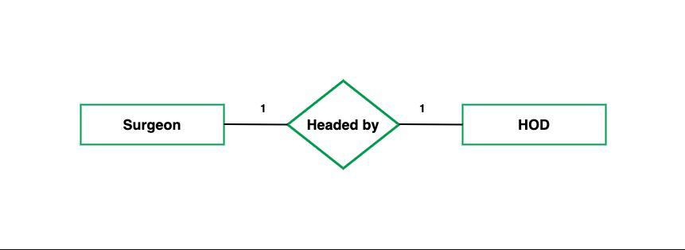
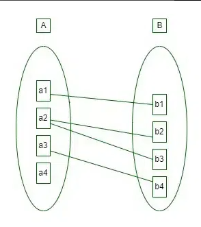
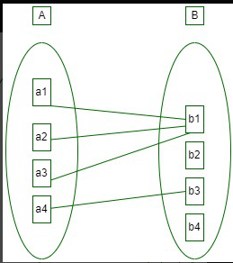
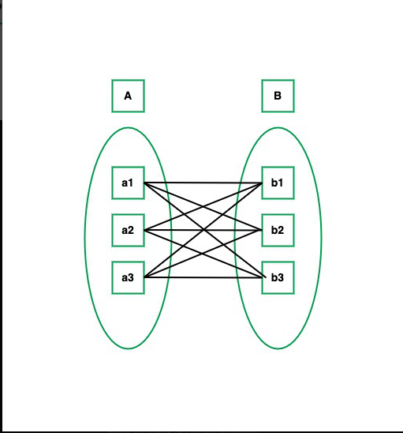
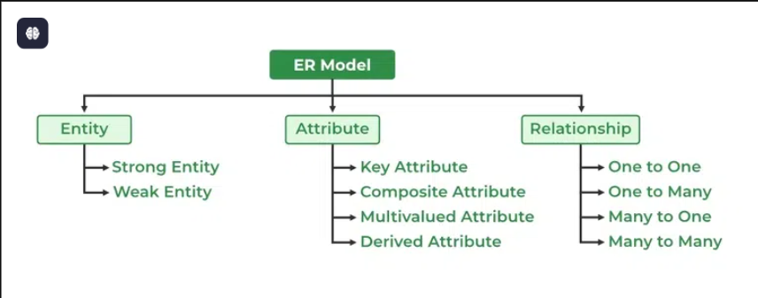
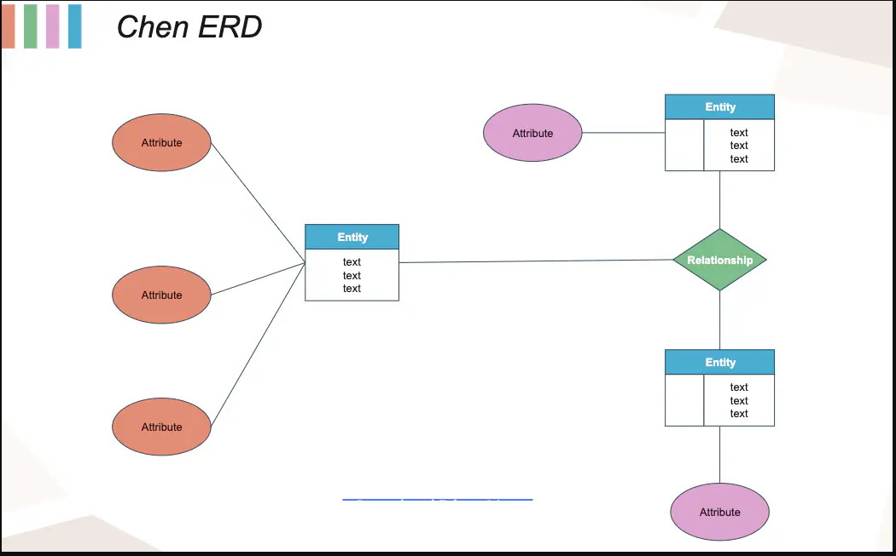

# (ER) Entity Relationship Model
## Entity
An **entity** is any object that exists in the database and has attributes. It can be a **person, place, object, or event** that we need to store information about.
##### Examples:
- **Elden Ring**: Entities would include **Player**, **Enemy**, **Weapon**, and **Boss**.
- **The Witcher 3**: Entities would be **Geralt (Player)**, **Triss (NPC)**, **Sword (Item)**, and **Kaer Morhen (Location)**.

Each of these **entities** has its own properties, which we call **attributes**.
## Attributes
Attributes define **characteristics** of an entity. Each entity has multiple attributes, and each attribute holds specific data.
##### Examples:
- **Player (Entity)** → Attributes: `Name`, `Health`, `Level`, `Experience Points`, `Inventory Capacity`.
##### Types of Attributes:
1. **Simple Attributes** → Cannot be divided further (e.g., `Character Name`, `Weapon Type`).
2. **Composite Attributes** → Can be broken down (e.g., `Full Name` can be split into `First Name` and `Last Name`).
3. **Derived Attributes** → Values derived from other attributes (e.g., `Character Age` is derived from `Date of Birth`).
4. **Multivalued Attributes** → Can have multiple values (e.g., a **Player** can have multiple **Weapons** in their inventory).
## Relationships
A relationship defines how **two or more entities are connected**, like **interactions between objects in a game**, like a **player using a weapon, an NPC giving a quest, or an enemy attacking a player**.
#### Types of Relationships:

1. **One-to-One (1:1) Relationship**
- Each entity in **A** is related to only one entity in **B**.
- **Example:** In **Cyberpunk 2077**, the **Player** (V) has **one main apartment** (unique home location).
- **ER Representation:** `Player (1) ←→ (1) Apartment`.


2. One-to-Many (1:M) Relationship
-  One entity in **A** is related to many entities in **B**.
- **Example:** In **The Witcher 3**, one **Quest** can have **multiple objectives**.
- **ER Representation:** `Quest (1) ←→ (M) Objectives`.


3. Many-to-One
When entities in one entity set can take part only once in the relationship set and entities in other entity sets can take part more than once in the relationship set, cardinality is many to one. Let us assume that a student can take only one course but one course can be taken by many students. So the cardinality will be n to 1. It means that for one course there can be n students but for one student, there will be only one course.

4. Many-to-Many (M:M) Relationship
- Many entities in **A** are related to many entities in **B**.
- **Example:** In **World of Warcraft**, a **Player** can complete **multiple Quests**, and each **Quest** can be completed by **multiple Players**.
- **ER Representation:** `Player (M) ←→ (M) Quest`.


>[!info]
>**Entities** = Objects in the game (Player, Weapon, NPC, Enemy).
>**Attributes** = Stats and properties (Health, Level, Damage, Name).
>**Relationships** = How entities interact (Player uses Weapon, Player fights Enemy, Player completes Quest).



---
# ER Diagram
An **ER Diagram** is a **visual representation** of how entities (game objects), their attributes (stats), and their relationships (interactions) are connected, like a **game’s world map with markers for important places and paths connecting them.**

```Example
[Player] --(accepts)--> [Quest] --(given by)--> [NPC]  
[Quest] --(grants)--> [Reward]
```

---
# Strong vs. Weak Entities
### 1.Strong Entity (Independent Main Character)

- **Definition:** A strong entity has a **primary key** and exists **independently**.
- **Game Analogy:**
    - The **Player Character** in an RPG is a **strong entity**.
    - In **Dark Souls**, the **Undead Warrior (Player)** exists **without requiring another entity**.
    - Attributes: `Player_ID`, `Health`, `Level`.

### **2.Weak Entity (Dependent Sidekick/Minion)**
- **Definition:** A weak entity **cannot exist without a strong entity** and depends on a **foreign key** for identification.
- **Game Analogy:**
    - A **Summoned Spirit (Elden Ring Ashes) or a Companion NPC** in **Fallout** is a weak entity.
    - Example: In **Persona 5**, a **Persona** is a weak entity that cannot exist without a **Player (Joker)**.
    - Attributes: `Persona_ID`, `Skillset`, `Affiliation` (dependent on `Player_ID`).

```Representation
[Player] --(owns)--> [Persona]
```

### 3.Cardinality (How Many Entities Relate?)
Cardinality defines **how many instances** of an entity can be related to another entity.

#### **Types of Cardinality**

| ER Model Concept                                  | Example Game Mechanic                           | Relational Model Conversion                             |
| ------------------------------------------------- | ----------------------------------------------- | ------------------------------------------------------- |
| **Entities → Tables**                             | **NPCs & Locations (Elden Ring)**               | Each entity becomes a table with attributes as columns. |
| **Relationships → Foreign Keys**                  | **NPCs belonging to Locations**                 | Use foreign keys to establish connections.              |
| **Weak Entities → Foreign Keys + Cascade Delete** | **Persona in Persona 5**                        | Weak entities rely on a strong entity (foreign key).    |
| **Multi-Valued Attributes → Separate Table**      | **Player Inventory (MMORPGs)**                  | Many-to-Many relationship with a bridge table.          |
| **Generalization → Superclass/Subclass Tables**   | **Class System in RPGs (Warrior, Mage, Rogue)** | One main table, sub-tables for unique attributes.       |
| **Aggregation → Higher-Level Relationships**      | **Guilds managing Quests in ESO**               | Treat relationships as separate entities.               |

**Example** :
```
[Player] --(1:M)--> [Quests]  
[Quests] --(M:M)--> [NPCs]
```

### 4.Generalization (Classes & Subclasses in a Game)
Generalization is when **common attributes of multiple entities are combined into a parent entity**.

**Example:** In **Skyrim**, the base class **Character** has different specializations:
- **Warrior** → Attributes: `Strength`, `Defense`.
- **Mage** → Attributes: `Mana`, `Magic Power`.
- **Rogue** → Attributes: `Dexterity`, `Stealth`.
### 5.Aggregation (Grouping Relationships as a Single Entity)
Aggregation is when a **relationship itself is treated as an entity** and linked to another entity.
**i.e** Imagine **Guilds in an MMO**. A **Guild is an entity**, but it is formed through relationships between **Players and Quests**.
**Example**
```
[Player] --(joins)--> [Guild]  
[Guild] --(organizes)--> [Quest]
[Quest] --(grants)--> [Reward]
```

## Summary 

| Concept            | Example                                        | Explanation                                                                                                                                                    |
| ------------------ | ---------------------------------------------- | -------------------------------------------------------------------------------------------------------------------------------------------------------------- |
| **ER Diagram**     | **Game World Map (Witcher 3, Skyrim)**         | Just like a game map shows locations and connections, an ER diagram shows entities (objects) and their relationships in a database.                            |
| **Strong Entity**  | **Main Character (Dark Souls Player)**         | A strong entity exists independently, like the player character in an RPG, who has unique attributes and does not rely on another entity.                      |
| **Weak Entity**    | **Persona in Persona 5**                       | A weak entity depends on a strong entity to exist, like how a Persona in Persona 5 requires the player character (Joker) to summon and use it.                 |
| **Cardinality**    | **One Player, Many Quests (Skyrim)**           | Defines how many instances of one entity relate to another. A single player can accept multiple quests, but each quest might have specific NPCs.               |
| **Generalization** | **Class System (Skyrim, Diablo, D&D RPGs)**    | Generalization groups similar entities into a parent entity. Characters in an RPG can be generalized as "Player" with subclasses like Warrior, Mage, or Rogue. |
| **Aggregation**    | **Guilds in MMOs (Elder Scrolls Online, WoW)** | When relationships themselves are treated as entities. A guild is an entity that manages players and organizes quests, grouping multiple relationships.        |

---
# Conversion of ER Model to Relational Model
The ER Model is a high-level **conceptual design**, while the Relational Model is the **practical implementation** in a database. The conversion process involves:

1. **Entities → Tables**
- Each entity in the ER Model becomes a **table** in the Relational Model.
- Attributes of the entity become **columns** in the table.
- The **Primary Key** uniquely identifies each record.

2. **Relationships → Foreign Keys**
- Relationships between entities are implemented using **foreign keys**.
- A foreign key is an attribute in one table that references the primary key of another table.

3. **Weak Entities → Foreign Keys + Cascade Delete**
- Weak entities don’t have a primary key of their own.
- They rely on a **foreign key** from a related strong entity.
- Enabling **cascade delete** ensures that if the strong entity is deleted, the weak entity records are also deleted.

4. **Multi-Valued Attributes → Separate Tables**
- If an attribute can have **multiple values**, it is stored in a **separate table** to maintain **normalization**.
- A separate table is used to link the main entity with multiple attribute values.

5. **Generalization → Superclass & Subclass Tables**
- When entities share **common attributes**, they are grouped into a **superclass** table.
- Subclasses store **specific attributes** for different types of entities.

6. **Aggregation → Higher-Level Relationships**
- When a relationship itself has attributes, it is treated as a **higher-level entity**.
- A separate table is created to manage this complex relationship. 

>[!info]
>This process ensures that the database is **structured, efficient, and maintains data integrity**.

